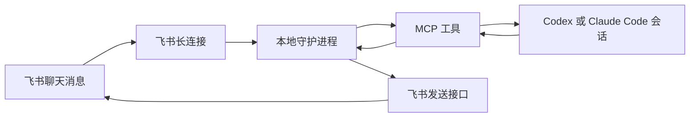

# curiosea-lark-connect

`curiosea-lark-connect` 是一个把本地编码智能体连接到飞书或 Lark 聊天的命令行工具、MCP（Model Context Protocol，模型上下文协议）服务和双运行时插件。

它解决的核心问题是：设计师、产品经理或其他协作者可以在群里明确提及机器人；本地 Codex thread（线程）或 Claude Code session（会话）收到这条消息后继续处理任务，把文本、截图、录屏或文件发回对应聊天，并在处理完成后给原消息添加确认反应。

当前版本的设计边界：

- 一个本地守护进程维护飞书长连接和本机内存状态。
- 同一时间只允许一个飞书聊天绑定到一个智能体会话。
- 群聊消息只有真实提及机器人时才会进入队列；已绑定单聊不要求提及机器人。
- 群聊可以通过 `lark_connect_search_chats` 搜索；单聊可以让用户给机器人私聊发送挑战码，再用 `lark_connect_wait_direct_chat_signal` 发现 `chatId`。
- 聊天 ID 不写入全局配置，只在 `lark_connect_bind_session` 里绑定。
- 守护进程 1 小时没有飞书事件或本地调用后自动退出。

## 安装

这一节主要写给用户的智能体：如果用户要求“帮我安装 lark-connect”，按下面顺序执行。不要把应用密钥写进插件清单、MCP 配置、README 或终端日志总结里。

### 前置条件

- 本机有 Node.js 22 或更新版本。
- 用户已经有一个飞书开放平台应用，并且机器人已经加入目标群，或用户可以打开机器人单聊发送确认挑战码。
- 应用已经开通接收消息事件和后续需要的飞书权限。接收消息至少需要消息事件订阅；确认消息会使用 reaction（反应）接口，通常还需要 `im:message` 和 `im:message.reactions:write_only`。
- 目标运行时已经安装：Codex、Claude Code，或两者都有。

### 安装插件

Codex：

```bash
codex plugin marketplace add LingoPlayground/lark-connect
codex plugin add lark-connect@lark-connect
```

Claude Code：

```bash
claude plugins marketplace add LingoPlayground/lark-connect
claude plugins install lark-connect@lark-connect --scope user
```

如果用户只使用其中一个运行时，只执行对应段落。安装后重新打开对应的智能体会话，让新插件和 MCP 服务生效。

### 配置飞书应用凭据

先让用户提供飞书应用 ID 和应用密钥。应用 ID 通常形如 `cli_xxx`；如果用户只给了飞书应用后台链接，也可以从链接里提取。

查看配置引导：

```bash
npx -y curiosea-lark-connect@latest setup
```

保存应用级凭据：

```bash
npx -y curiosea-lark-connect@latest setup --app-id cli_xxx --app-secret '<secret>'
```

这个命令只保存应用 ID 和应用密钥，不保存聊天 ID。默认配置文件位于：

```text
~/.config/curiosea-lark-connect/config.json
```

检查配置和机器人身份：

```bash
npx -y curiosea-lark-connect@latest doctor --live
```

### 启动守护进程

MCP 工具不会自动启动守护进程。调用工具时如果返回 `DAEMON_NOT_RUNNING`，先执行：

```bash
npx -y curiosea-lark-connect@latest daemon start
```

另开一个终端或后台任务后，可以检查状态：

```bash
npx -y curiosea-lark-connect@latest daemon status
```

需要停止时：

```bash
npx -y curiosea-lark-connect@latest daemon stop
```

### 搜索和绑定聊天

在 Codex 或 Claude Code 里使用插件提供的 MCP 工具：

1. 如果目标是群聊且用户没有提供 `chatId`，先调用 `lark_connect_search_chats`，用群名或关键词搜索机器人可见群聊。
2. 如果搜索不到目标群，提示用户确认群名；如果群不存在，请用户创建群；如果群已存在，请把当前应用机器人拉入群后重试。
3. 如果目标是单聊且用户没有提供 `chatId`，生成一段唯一挑战文本，先把这段文本展示给用户，请用户在机器人单聊里原样发送；然后调用 `lark_connect_wait_direct_chat_signal` 等待这条私聊消息。
4. 拿到目标群或单聊 `chatId` 后，调用 `lark_connect_bind_session`。
5. 传入 `chatId`、`agentKind`、`agentSessionId`、`workspace`。
6. 如果目标聊天已经绑定到旧会话，只有在用户明确要求接管时才传 `replace: true`。

绑定后，常用工具是：

| 工具 | 用途 |
|---|---|
| `lark_connect_daemon_status` | 查看守护进程状态。 |
| `lark_connect_search_chats` | 搜索机器人可见的飞书群聊，返回候选 `chatId`。 |
| `lark_connect_wait_direct_chat_signal` | 等待用户给机器人单聊发送指定挑战文本，返回单聊 `chatId` 和建议绑定参数。 |
| `lark_connect_bind_session` | 把一个飞书聊天绑定到当前 Codex thread 或 Claude Code session。 |
| `lark_connect_poll_messages` | 立即领取当前绑定聊天的待处理消息。 |
| `lark_connect_wait_messages` | 限时等待当前绑定聊天的待处理消息。 |
| `lark_connect_ack_message` | 确认一条消息已经处理完成，并给原始飞书消息添加 `OK` reaction（反应）。 |
| `lark_connect_send_message` | 向当前绑定聊天发送文本，可选回复某条原消息。 |
| `lark_connect_send_image` | 向当前绑定聊天发送本地图片。 |
| `lark_connect_send_video` | 向当前绑定聊天发送本地视频和封面图。 |
| `lark_connect_send_file` | 向当前绑定聊天发送本地文件。 |
| `lark_connect_download_resource` | 下载当前会话收到的图片或文件资源。 |

### 长时间等待聊天消息

短等待用 `lark_connect_wait_messages`，建议 `timeoutMs: 60000`。如果 1 分钟没有消息，不要一直阻塞当前回合。

Codex 应使用 thread automation（线程自动化）定时唤醒，约 5 分钟后再次 `poll`。

Claude Code 应使用 background shell（后台 shell）：

```bash
npx -y curiosea-lark-connect@latest wait --agent-session-id <绑定时使用的 agentSessionId> --timeout-ms 300000
```

`agentSessionId` 必须和 `lark_connect_bind_session` 里传入的是同一个值。

## 工程说明

### 目录结构

```text
src/cli.js                  命令行入口
src/config.js               本地配置读写和运行时配置解析
src/lark/                   飞书长连接、消息、reaction（反应）、资源下载和连通性检查
src/daemon/                 本地守护进程、HTTP 接口和内存路由状态
src/mcp/server.js           MCP 标准输入输出服务和工具定义
plugins/lark-connect/       Codex 和 Claude Code 共用的插件载荷
tests/                      node:test 测试
.github/workflows/release.yml  tag 触发的 npm 发布流程
```

### 工作原理



关键路径：

1. `daemon start` 使用飞书 Node.js SDK（软件开发工具包）建立长连接。
2. 守护进程接收已绑定聊天里的消息；群聊必须明确提及机器人，单聊不要求提及。
3. 消息进入内存队列后，MCP 的 `poll` 或 `wait` 工具把消息交给绑定会话。
4. 智能体处理任务后，通过发送工具把文本、图片、视频或文件发回对应聊天。
5. 智能体调用 `ack` 后，守护进程给原始飞书消息添加 `OK` reaction（反应），并把本地消息状态标为已确认。

### 配置和状态

- 应用 ID 和应用密钥保存在本机配置文件，文件权限设为 `0600`。
- `FEISHU_APP_ID` 和 `FEISHU_APP_SECRET` 仍可作为运行时覆盖，但正式安装优先使用 `setup` 写入的本地配置。
- `LARK_CONNECT_DAEMON_PORT` 可以覆盖本地守护进程端口，默认是 `51745`。
- 绑定、消息队列和去重状态都只在守护进程内存里保存，进程重启后丢失；搜索结果只随单次请求返回。
- 当前不持久化 `thread_id` 或 `root_id`，它们只作为飞书消息元数据保留。

### 插件载荷

本仓库同时发布 Codex 和 Claude Code 插件：

```text
plugins/lark-connect/.codex-plugin/plugin.json
plugins/lark-connect/.claude-plugin/plugin.json
plugins/lark-connect/codex.mcp.json
plugins/lark-connect/.mcp.json
plugins/lark-connect/skills/
```

两份 MCP 描述文件只是为了匹配不同运行时的加载格式，实际都会启动同一个命令：

```bash
npx -y curiosea-lark-connect@latest mcp
```

仓库根目录不提交 `.mcp.json` 或 `.codex/config.toml`。如果需要调试源码，可以在本机用户级或会话级 MCP 配置里临时指向：

```bash
node src/cli.js mcp
```

### 本地开发

安装依赖：

```bash
npm install
```

常用命令：

```bash
npm test
npm run build
npm pack --dry-run
```

本地源码调试命令：

```bash
node src/cli.js --help
node src/cli.js setup
node src/cli.js doctor --live
node src/cli.js daemon start
node src/cli.js mcp
```

调试指定聊天的一次事件：

```bash
node src/cli.js debug listen-once --chat-id oc_xxx
```

### 发布

发布通过 Git tag 触发，不手工运行 `npm publish`。

1. 在 PR 里更新 `package.json` 版本号并合并到 `main`。
2. 确认 npmjs.com 已为 `curiosea-lark-connect` 配置 Trusted Publishing，绑定本仓库和 `.github/workflows/release.yml`。
3. 在最新 `main` 上打和 `package.json` 一致的 tag：

```bash
git switch main
git pull --ff-only
VERSION=$(node -p "require('./package.json').version")
git tag "v$VERSION"
git push origin "v$VERSION"
```

Release workflow 会校验 tag 版本等于 `package.json`，然后运行测试、构建、打包预检、`npm publish --provenance`，并创建 GitHub Release。预发布 tag，例如 `v0.2.0-rc.1`，会被标记为 GitHub prerelease。
