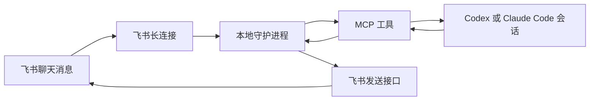

# curiosea-lark-connect

`curiosea-lark-connect` 是一个把本地编码智能体连接到飞书或 Lark 聊天的命令行工具、MCP（Model Context Protocol，模型上下文协议）服务和双运行时插件。

它解决的核心问题是：设计师、产品经理或其他协作者可以在群里明确提及机器人；本地 Codex thread（线程）或 Claude Code session（会话）收到这条消息后继续处理任务，把文本、截图、录屏或文件发回对应聊天，并在处理完成后给原消息添加确认反应。

这个工具的背景不是“把聊天消息转成命令”这么窄，而是让个人 Agent 进入真实团队工作场景。它应该能看见团队最近讨论的上下文，和同事完成异步交流，也能 @ 其他同事的 Agent 一起协作。换句话说，lark-connect 同时支持 Agent 与同事的交流，以及 Agent 与其他同事的 Agent 交流。

当前版本的设计边界：

- 一个本地守护进程维护飞书长连接和本机内存状态。
- 同一时间只允许一个飞书聊天绑定到一个智能体会话。
- 群聊消息只有真实提及机器人时才会进入队列；已绑定单聊不要求提及机器人。
- 群聊可以通过 `lark_connect_search_chats` 搜索；单聊可以让用户给机器人私聊发送挑战码，再用 `lark_connect_wait_direct_chat_signal` 发现 `chatId`。
- 绑定后可以通过 `lark_connect_get_chat_context` 读取近期聊天上下文，默认最近 10 条消息。
- 绑定后可以通过 `lark_connect_get_chat_members` 查询群里的人类成员，并通过 `members/bots` 接口查询群内机器人。
- 聊天 ID 不写入全局配置，只在 `lark_connect_bind_session` 里绑定。
- 守护进程 1 小时没有飞书事件或本地调用后自动退出。

## 安装

这一节主要写给用户的智能体：如果用户要求“帮我安装 lark-connect”，按下面顺序执行。不要把应用密钥写进插件清单、MCP 配置、README 或终端日志总结里。

### 前置条件

- 本机有 Node.js 22 或更新版本。
- 用户已经有一个飞书开放平台应用，并且机器人已经加入目标群，或用户可以打开机器人单聊发送确认挑战码。
- 应用已经开通接收消息事件和后续需要的飞书权限。接收消息至少需要消息事件订阅；确认消息会使用 reaction（反应）接口，通常还需要 `im:message` 和 `im:message.reactions:write_only`；读取群聊上下文还需要应用具备获取群组历史消息的权限；查询人类成员和群内机器人还需要应用具备读取群成员与群内机器人列表的权限，并且机器人已经在目标群里。
- 目标运行时已经安装：Codex、Claude Code，或两者都有。

### 安装插件

Codex：

```bash
codex plugin marketplace add LingoPlayground/lark-connect
codex plugin add lark-connect@lark-connect
```

Claude Code：

```bash
claude plugins marketplace add LingoPlayground/lark-connect
claude plugins install lark-connect@lark-connect --scope user
```

如果用户只使用其中一个运行时，只执行对应段落。安装后重新打开对应的智能体会话，让新插件和 MCP 服务生效。

### 配置飞书应用凭据

先让用户提供飞书应用 ID 和应用密钥。应用 ID 通常形如 `cli_xxx`；如果用户只给了飞书应用后台链接，也可以从链接里提取。

查看配置引导：

```bash
npx -y curiosea-lark-connect@latest setup
```

保存应用级凭据：

```bash
npx -y curiosea-lark-connect@latest setup --app-id cli_xxx --app-secret '<secret>'
```

这个命令只保存应用 ID 和应用密钥，不保存聊天 ID。默认配置文件位于：

```text
~/.config/curiosea-lark-connect/config.json
```

检查配置和机器人身份：

```bash
npx -y curiosea-lark-connect@latest doctor --live
```

### 启动守护进程

MCP 工具不会自动启动守护进程。调用工具时如果返回 `DAEMON_NOT_RUNNING`，先执行：

```bash
npx -y curiosea-lark-connect@latest daemon start
```

这个命令默认会在后台启动守护进程并立即返回，适合 Codex 和 Claude Code 的 shell 调用。开发调试时如果希望前台常驻，可以使用 `daemon start --foreground`。

启动后可以检查状态：

```bash
npx -y curiosea-lark-connect@latest daemon status
```

需要停止时：

```bash
npx -y curiosea-lark-connect@latest daemon stop
```

### 搜索和绑定聊天

在 Codex 或 Claude Code 里使用插件提供的 MCP 工具：

1. 如果目标是群聊且用户没有提供 `chatId`，先调用 `lark_connect_search_chats`，用群名或关键词搜索机器人可见群聊。
2. 如果搜索不到目标群，提示用户确认群名；如果群不存在，请用户创建群；如果群已存在，请把当前应用机器人拉入群后重试。
3. 如果目标是单聊且用户没有提供 `chatId`，生成一段唯一挑战文本，先把这段文本展示给用户，请用户在机器人单聊里原样发送；然后调用 `lark_connect_wait_direct_chat_signal`，传入 `challengeText`、`agentKind`、`agentSessionId`、`workspace` 和 `timeoutMs`。如果返回 `signal: null`，说明这次等待没有收到匹配私聊消息；请用户确认发给了当前机器人且文本完全一致，再用新的挑战文本重试。
4. 拿到目标群或单聊 `chatId` 后，调用 `lark_connect_bind_session`。
5. 传入 `chatId`、`agentKind`、`agentSessionId`、`workspace`。
6. 如果目标聊天已经绑定到旧会话，只有在用户明确要求接管时才传 `replace: true`。
7. 如果需要理解已有协作背景，调用 `lark_connect_get_chat_context` 读取最近消息；不传 `limit` 时默认最近 10 条。
8. 如果需要 @ 人类同事或其他机器人，先调用 `lark_connect_get_chat_members` 获取候选成员和群内机器人；机器人返回值里的 `openId` 可直接作为 @ 目标。
9. 绑定成功后必须立即调用 `lark_connect_wait_messages`，建议 `timeoutMs: 60000`，让当前会话马上进入监听。

绑定后，常用工具是：

| 工具 | 用途 |
|---|---|
| `lark_connect_daemon_status` | 查看守护进程状态。 |
| `lark_connect_search_chats` | 搜索机器人可见的飞书群聊，返回候选 `chatId`。 |
| `lark_connect_wait_direct_chat_signal` | 等待用户给机器人单聊发送指定挑战文本，返回单聊 `chatId` 和建议绑定参数。 |
| `lark_connect_bind_session` | 把一个飞书聊天绑定到当前 Codex thread 或 Claude Code session。 |
| `lark_connect_get_chat_context` | 读取当前绑定聊天的近期消息，默认最近 10 条，按新到旧返回，用于理解协作上下文。 |
| `lark_connect_get_chat_members` | 查询当前绑定聊天的人类成员，并通过 `members/bots` 返回群内机器人。 |
| `lark_connect_poll_messages` | 立即领取当前绑定聊天的待处理消息。 |
| `lark_connect_wait_messages` | 限时等待当前绑定聊天的待处理消息。 |
| `lark_connect_ack_message` | 确认一条消息已经处理完成，并给原始飞书消息添加 `OK` reaction（反应）。 |
| `lark_connect_send_message` | 向当前绑定聊天发送文本，可选回复某条原消息，也可以 @ 人类同事或其他机器人。 |
| `lark_connect_send_image` | 向当前绑定聊天发送本地图片。 |
| `lark_connect_send_video` | 向当前绑定聊天发送本地视频和封面图。 |
| `lark_connect_send_file` | 向当前绑定聊天发送本地文件。 |
| `lark_connect_download_resource` | 下载当前会话收到的图片或文件资源。 |

### 长时间等待聊天消息

短等待用 `lark_connect_wait_messages`，建议 `timeoutMs: 60000`。如果 1 分钟没有消息，不要把超时当作监听结束；后续只有两个选择：继续调用 `lark_connect_wait_messages` 做下一轮短等待，或者建立约 5 分钟的心跳。

Codex 应使用 thread automation（线程自动化）定时唤醒，约 5 分钟后先调用 `lark_connect_poll_messages`。如果有消息，处理、回复、ack 后再做 1 分钟短等待；如果没有消息，继续下一轮心跳或改用短等待。

Claude Code 应使用 background shell（后台 shell）：

```bash
npx -y curiosea-lark-connect@latest wait --agent-session-id <绑定时使用的 agentSessionId> --timeout-ms 300000
```

`agentSessionId` 必须和 `lark_connect_bind_session` 里传入的是同一个值。

### 发送回复和 @

`lark_connect_send_message` 支持三个协作参数：

- `replyToMessageId`：回复某条飞书原始消息。
- `replyInThread`：在飞书话题里回复。
- `mentions`：@ 人类同事或其他机器人。每项至少传 `openId`，可选 `name` 和 `isBot`。只传 `mentions` 不传 `text` 时，会发送一条只有 @ 的提醒消息。

如果要 @ 某个真实对象，可以从 `lark_connect_get_chat_context` 返回的 `sender` 或 `mentions` 字段里取标识；只有当 `sender.idType` 或 `mentions[].idType` 是 `open_id` 时，才能把对应 `id` 作为 `mentions[].openId`。不要编造用户或机器人 ID。

如果需要先查看候选对象，调用 `lark_connect_get_chat_members`。它会返回 `members` 和 `bots` 两类结果：`members` 来自飞书群成员接口；当 `memberIdType` 是 `open_id` 时，可以把 `memberId` 作为 `mentions[].openId`。`bots` 来自 `/open-apis/im/v1/chats/{chat_id}/members/bots`。机器人结果里的 `openId` 是机器人的 open_id，可以作为发送消息时的 @ 目标。

## 工程说明

### 目录结构

```text
src/cli.js                  命令行入口
src/config.js               本地配置读写和运行时配置解析
src/lark/                   飞书长连接、消息、聊天上下文、群成员、reaction（反应）、资源下载和连通性检查
src/daemon/                 本地守护进程、HTTP 接口和内存路由状态
src/mcp/server.js           MCP 标准输入输出服务和工具定义
plugins/lark-connect/       Codex 和 Claude Code 共用的插件载荷
tests/                      node:test 测试
.github/workflows/release.yml  tag 触发的 npm 发布流程
```

### 工作原理



关键路径：

1. `daemon start` 使用飞书 Node.js SDK（软件开发工具包）建立长连接。
2. 守护进程接收已绑定聊天里的消息；群聊必须明确提及机器人，单聊不要求提及。
3. 需要背景时，MCP 的 `lark_connect_get_chat_context` 会通过飞书历史消息接口读取当前绑定聊天的近期消息；这些消息不会进入待处理队列，也不需要 ack。
4. 需要 @ 协作者时，MCP 的 `lark_connect_get_chat_members` 会读取当前聊天的人类成员，并通过 `members/bots` 查询群内机器人。
5. 新消息进入内存队列后，MCP 的 `poll` 或 `wait` 工具把消息交给绑定会话。
6. 智能体处理任务后，通过发送工具把文本、图片、视频或文件发回对应聊天，可以回复原消息，也可以 @ 人类同事或其他机器人。
7. 智能体调用 `ack` 后，守护进程给原始飞书消息添加 `OK` reaction（反应），并把本地消息状态标为已确认。

### 配置和状态

- 应用 ID 和应用密钥保存在本机配置文件，文件权限设为 `0600`。
- `FEISHU_APP_ID` 和 `FEISHU_APP_SECRET` 仍可作为运行时覆盖，但正式安装优先使用 `setup` 写入的本地配置。
- `LARK_CONNECT_DAEMON_PORT` 可以覆盖本地守护进程端口，默认是 `51745`。
- 绑定、消息队列和去重状态都只在守护进程内存里保存，进程重启后丢失；搜索结果只随单次请求返回。
- 未绑定单聊挑战消息只在守护进程内存里短暂保留，最多 5 分钟或 50 条；替换绑定会清空旧等待者和这部分缓冲。
- 当前不持久化 `thread_id` 或 `root_id`，它们只作为飞书消息元数据保留。

### 插件载荷

本仓库同时发布 Codex 和 Claude Code 插件：

```text
plugins/lark-connect/.codex-plugin/plugin.json
plugins/lark-connect/.claude-plugin/plugin.json
plugins/lark-connect/codex.mcp.json
plugins/lark-connect/.mcp.json
plugins/lark-connect/skills/
```

两份 MCP 描述文件只是为了匹配不同运行时的加载格式，实际都会启动同一个命令：

```bash
npx -y curiosea-lark-connect@latest mcp
```

仓库根目录不提交 `.mcp.json` 或 `.codex/config.toml`。如果需要调试源码，可以在本机用户级或会话级 MCP 配置里临时指向：

```bash
node src/cli.js mcp
```

### 本地开发

安装依赖：

```bash
npm install
```

常用命令：

```bash
npm run quality
npm run lint
npm test
npm run build
npm run pack:check
```

`npm run quality` 是本仓库的本地质量门禁入口，包含 build、lint、test 和 pack 检查，和拉取请求里的 `Node Tool Gates` 检查保持一致。

本地源码调试命令：

```bash
node src/cli.js --help
node src/cli.js setup
node src/cli.js doctor --live
node src/cli.js daemon start --foreground
node src/cli.js mcp
```

调试指定聊天的一次事件：

```bash
node src/cli.js debug listen-once --chat-id oc_xxx
```

### 发布

发布通过 Git tag 触发，不手工运行 `npm publish`。

1. 在 PR 里更新 `package.json` 版本号并合并到 `main`。
2. 确认 npmjs.com 已为 `curiosea-lark-connect` 配置 Trusted Publishing，绑定本仓库和 `.github/workflows/release.yml`。
3. 在最新 `main` 上打和 `package.json` 一致的 tag：

```bash
git switch main
git pull --ff-only
VERSION=$(node -p "require('./package.json').version")
git tag "v$VERSION"
git push origin "v$VERSION"
```

Release workflow 会校验 tag 版本等于 `package.json`，然后运行测试、构建、打包预检、`npm publish --provenance`，并创建 GitHub Release。预发布 tag，例如 `v0.2.0-rc.1`，会被标记为 GitHub prerelease。
