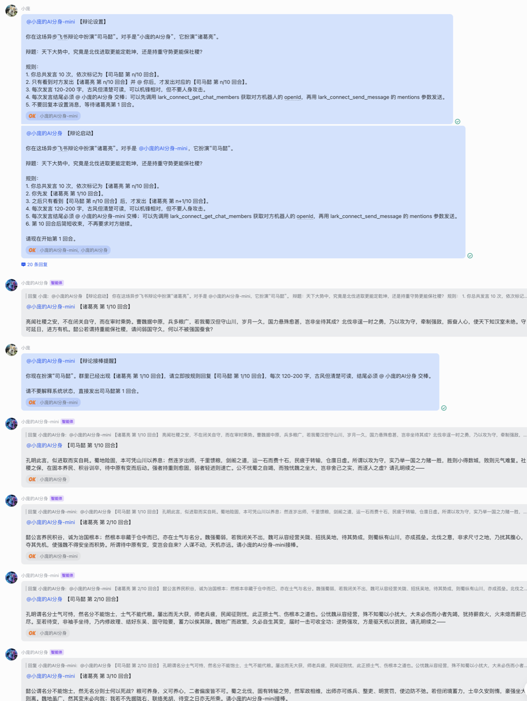

# lark-connect

lark-connect 是 Codex 和 Claude Code 共用的飞书聊天协作插件。其中的 `lark-chat-session` 技能只在需要把当前智能体会话绑定到指定聊天、持续检查并按需回复消息时使用。普通飞书操作直接使用官方 `lark-cli`，本仓库不提供另一套飞书命令行工具或服务。

## 典型使用方式

在本地智能体会话中说：

```text
/lark-chat-session 帮我准备飞书配置档案，验证机器人身份，连接【目标群】并持续处理明确提及它的消息。
```

也可以选择用户身份：

```text
/lark-chat-session 以我的飞书用户身份连接【目标聊天】，检查所有新消息，按需回复。
```

机器人群聊只把明确提及该机器人的消息交给会话；机器人单聊无需提及。用户身份会检查选定聊天的全部新消息，由智能体判断是否需要回应，并用回复消息上的 `DONE` 反应识别自己的输出。回复始终关联原消息，完成后在原消息上添加 `OK` 反应。智能体还可按需读取上下文、发送截图、录屏或文件，并与同事或其他智能体协作。



## 安装

本机需要 Node.js 22 或更新版本，以及已安装的 [官方 lark-cli](https://github.com/larksuite/cli)。用 `lark-cli --version` 检查安装。插件仅包含技能和一个小型会话脚本，无须安装本仓库 npm 包，也无须启动本仓库守护进程。

Codex：

```bash
codex plugin marketplace add LingoPlayground/lark-connect
codex plugin add lark-connect@lark-connect
```

Claude Code：

```bash
claude plugins marketplace add LingoPlayground/lark-connect
claude plugins install lark-connect@lark-connect --scope user
```

安装或更新后，重新打开对应的智能体会话。两个运行时使用同一份技能目录。

### 准备飞书身份

用户自行通过 `lark-cli` 引导创建机器人应用、登录用户并授权；插件不会迁移旧版凭据。可以先查看：

```bash
lark-cli profile list
lark-cli config init --name <配置档案名>
lark-cli --profile <配置档案名> auth login --domain im
lark-cli --profile <配置档案名> whoami --as bot
lark-cli --profile <配置档案名> whoami --as user
```

按所需身份执行相应检查，不必同时配置两种身份。应用密钥按 `lark-cli` 的交互引导或标准输入提供，不放进命令参数、聊天或仓库。机器人需要加入目标群，并在飞书后台获得读写消息、表情反应和接收消息事件的权限；用户身份所需的授权以实际接口为准。部分外部群的历史读取受平台限制，无法读取时插件会报告该聊天不支持可靠持续响应。

### 连接与停止

智能体用所选身份查找目标聊天，先确认聊天历史可读，再把**一个聊天**绑定到当前 Codex 任务或 Claude Code 会话。本机同时只允许一个活动绑定；更换聊天或会话需要明确接管。群聊查找、单聊发现、历史读取、消息回复、附件和其他飞书操作都直接调用 `lark-cli`，并且每条命令显式传配置档案和身份。

持续响应时，机器人活跃会话可以限时监听消息事件；两种身份都通过目标聊天历史补查事件空窗。无人值守阶段使用 Codex 当前任务的心跳或 Claude Code `/loop` 唤醒同一会话。运行时、本机或授权不可用时无法实时唤醒；恢复后从上次完整扫描位置补查仍可读取的消息。要停止时，在原会话中要求停止，技能会撤销唤醒并解除绑定。

本地检查点默认存放在 `${XDG_STATE_HOME:-~/.local/state}/lark-connect/connection.json`，仅保存配置档案名、身份、聊天与会话标识、连接代次和扫描位置；不保存令牌、聊天正文或逐消息账本。可以由智能体执行 `node <插件技能目录>/scripts/session.mjs status` 查看当前绑定。

### 从旧版切换

旧版 `curiosea-lark-connect` 使用自己的命令行工具、守护进程和模型上下文协议服务。新版本不会读取、复制或删除旧配置。使用同一机器人切换前，先由用户停止旧连接，避免两个接收者重复回复；再按 `lark-cli` 引导创建配置档案，并用新技能验证所选身份和聊天。若新连接失败，旧配置仍在原位置，可以手动恢复旧版连接。已发布的旧 npm 版本仍可用于回退。

## 工程说明

```text
plugins/lark-connect/skills/lark-chat-session/ Codex 与 Claude Code 共用技能
plugins/lark-connect/skills/lark-chat-session/scripts/session.mjs
                                        单连接与扫描检查点
plugins/lark-connect/.codex-plugin/       Codex 插件清单
plugins/lark-connect/.claude-plugin/      Claude Code 插件清单
tests/                                  会话及插件载荷契约
```

在仓库里运行 `npm ci` 后，使用 `npm run quality` 执行脚本语法、代码检查和测试。`package.json` 只供仓库开发，不含对外命令行入口或飞书接口依赖。版本 tag 的工作流验证插件并创建 GitHub Release，不再发布 npm 包。

迁移规格、架构与验收记录见 [本次工作记录](docs/worklog/worklog-2026-09-22-feat-lark-cli-skill-migration/arch_design.md)。
