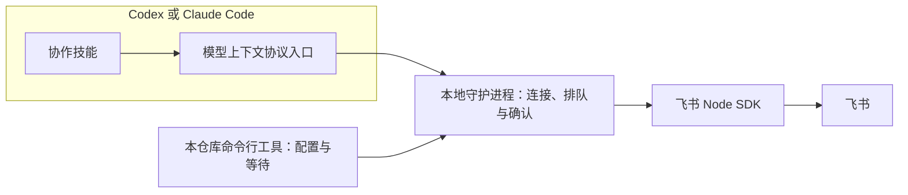
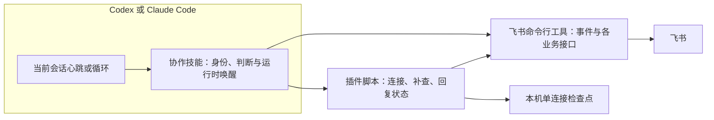
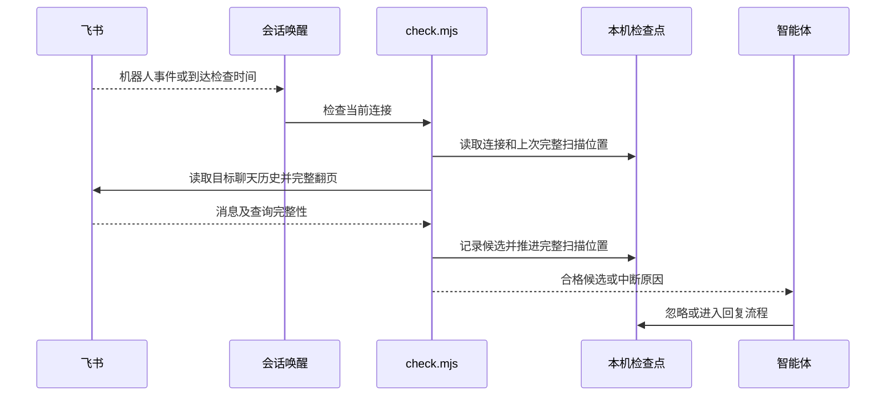

# 架构设计：以飞书命令行工具和技能替换专用服务

## 1. 人工评审重点

- **评审状态**：待人工确认；不得据此开始代码替换。
- **核心决定**：插件以 `lark-cli` 作为唯一飞书接口；机器人活跃会话使用消息事件，机器人和用户身份的无人值守阶段都从目标聊天历史补查。插件只保留技能和少量单用途脚本，不再发布自己的命令行工具、守护进程或模型上下文协议服务。
- **状态归属**：单连接关系与消息处理检查点保存在本机一个不含凭据的状态文件中，由技能脚本独占更新。这是实现跨唤醒去重和安全恢复所必需的状态，不建立消息数据库。
- **运行时归属**：Codex 使用当前会话的心跳自动化唤醒；Claude Code 使用当前会话的 `/loop`。脚本只检查飞书和管理本机检查点，不自建常驻进程或唤醒服务。
- **首要风险**：用户身份无消息事件；飞书历史接口可能拒绝部分群或漏掉话题回复。设计要求连接前验证读取能力，话题群采用能覆盖回复的查询，查询不完整时报告中断。
- **需要确认**：上述三项结构决定、旧 npm 命令行停止更新，以及不能安全判定发送结果时暂停该消息并请求人工核查的处理方式。

## 2. 架构总览

### 2.1 当前架构现状

当前插件通过本仓库的命令行工具启动守护进程，再由模型上下文协议工具把飞书消息投递给智能体。



#### 2.1.1 当前目录结构

```text
src/cli.js                    自有命令行入口
src/config.js                 本仓库应用凭据
src/daemon/                   绑定、队列、等待、去重、日志
src/lark/                     飞书接口与长连接
src/mcp/server.js             模型上下文协议工具
plugins/lark-connect/         双运行时插件、模型上下文协议描述与技能
tests/                        各旧模块和插件载荷测试
```

#### 2.1.2 当前事实依据

- `src/daemon/runtime.js` 以进程内映射保存唯一绑定、已见消息、队列、等待者及确认状态；进程重启会丢失这些信息。
- `src/cli.js` 提供配置、诊断、等待、日志和服务管理；`src/mcp/server.js` 声明 14 个工具，均依赖本仓库服务路径。
- `plugins/lark-connect/.codex-plugin/plugin.json`、`plugins/lark-connect/codex.mcp.json` 和 `plugins/lark-connect/.mcp.json` 将插件接到该服务；两个技能均按旧入口编排。
- `AGENTS.md` 当前规定正式路径不得依赖 `lark-cli`，并规定旧配置与发布方式。实施本设计时必须同步修订这些已失效的工程约束。

### 2.2 目标设计概览

插件技能选择身份并编排协作；飞书接口由 `lark-cli` 执行，三个单用途脚本只处理连接检查点、补查与有状态回复。



#### 2.2.1 设计边界

- **目标**：两种身份都可进入一个目标聊天、发现新消息、按规则处理并在原消息下回复；无人值守空窗可补查且重复检查不自动重发。
- **非目标**：自建飞书通用接口、常驻守护进程、跨机器协调、迁移旧密钥、一次连接多个聊天。
- **约束与不变量**：所有调用都显式携带配置档案和 `--as` 身份；状态文件无凭据和聊天正文；当前机器仅允许一个有效连接。用户身份检查选定聊天的全部新消息，智能体决定是否回复；机器人群聊只处理结构化提及，机器人单聊处理全部新消息。两种身份均不得把自己生成的回复再次当成任务。
- **兼容行为**：聊天查找、机器人单聊发现、上下文、成员、附件、原消息回复、提及、`OK` 确认以及 Codex 和 Claude Code 持续响应。

#### 2.2.2 目标目录结构

```text
plugins/lark-connect/
├── .codex-plugin/plugin.json               （改：移除模型上下文协议服务）
├── .claude-plugin/plugin.json              （改：描述技能能力）
└── skills/
    ├── lark-connect-setup/SKILL.md         （改：引导官方配置）
    └── lark-connect/
        ├── SKILL.md                        （改：双身份和唤醒流程）
        ├── scripts/connect.mjs             （新增：连接与停止）
        ├── scripts/check.mjs               （新增：历史补查与候选输出）
        └── scripts/reply.mjs               （新增：安全回复与确认）
tests/
├── collaboration-scripts.test.mjs          （新增：脚本行为与失败状态）
└── plugin-packaging.test.mjs               （改：纯技能载荷）
src/                                        （删除：旧命令行、守护进程、SDK 与模型上下文协议）
```

`package.json` 仅作为本仓库的私有开发和测试清单保留，不再包含可发布的命令行入口或飞书 SDK 依赖；市场清单继续提供双运行时插件。具体旧文件处置见第 4 节。

### 2.3 共享模型设计

#### 2.3.1 模型总表

| 模型 | 变更状态 | 代码或存储映射 |
|---|---|---|
| `ConnectionCheckpoint` | 本次新增 | `plugins/lark-connect/skills/lark-connect/scripts/connect.mjs` 管理的本机 JSON 状态文件 |
| `MessageOutcome` | 本次新增 | 同一状态文件中的按飞书消息标识记录；`check.mjs` 和 `reply.mjs` 共用 |
| `Binding` | 计划移除 | `src/daemon/runtime.js` 的进程内绑定，改由 `ConnectionCheckpoint` 承接 |

#### 2.3.2 模型详情

##### 2.3.2.1 `ConnectionCheckpoint`

- **承接需求**：`2.1`、`2.2`、`2.4`、`2.6`；尤其是单连接与无人值守恢复。
- **职责与行为**：记录配置档案、身份、目标聊天、智能体运行时与会话标识、连接代次、上次完整扫描位置和 `MessageOutcome`。不保存令牌、应用密钥或聊天正文。默认位于 `${XDG_STATE_HOME:-~/.local/state}/lark-connect/connection.json`，文件权限限当前用户。脚本读写时校验会话标识与代次，避免旧心跳在切换后处理新聊天。
- **设计理由**：没有常驻进程时，跨智能体唤醒必须保留最小检查点；一个本机文件足够承接当前单连接约束，数据库和通用存储层没有收益。
- **同一性判断**：本机唯一活动连接；每次显式接管生成新的连接代次。
- **状态与存续范围**：连接时原子写入，检查和回复后原子更新，停止时标为停止并撤销运行时唤醒；权限仅当前用户可读写。
- **有效状态规则**：同一机器至多一个活动连接；检查点的身份、聊天与会话标识必须一起匹配后才能读取或写入消息（每次脚本调用时）。

##### 2.3.2.2 `MessageOutcome`

- **承接需求**：`2.3`、`2.4`；重复消息、按需回复及部分失败。
- **职责与行为**：按原消息标识记录 `pending`、`ignored`、`sending`、`replied`、`confirmed` 或 `needs_review`。`ignored` 记录用户身份下无需回应的判断；`sending` 先于飞书写入，`replied` 保存实际回复标识，`confirmed` 表示 `OK` 反应成功。旧记录仅在对应历史窗口不再需要时清理。
- **设计理由**：用户身份与智能体回复可拥有相同发送者标识，只按发送者过滤会漏掉用户指令；按原消息与发送结果记账才能同时防循环和防重复。
- **同一性判断**：配置档案、身份、聊天标识、原消息标识的组合。
- **状态与存续范围**：收到候选消息时产生，智能体可标记忽略或要求回复；发送结果不确定时停在 `needs_review`，不得自动重发。
- **有效状态规则**：一个原消息只能进入一次发送中的状态；未确认发送成功前不得标记完成；已回复后补确认不得再发送回复（每次状态转换时）。

## 3. 分项设计

### 3.1 身份、连接与聊天能力

#### 3.1.1 原始需求

- `spec.md#2.1`、`VAL-IDENTITY-001～003`：配置档案和机器人或用户身份贯穿一次协作，不静默切换。
- `spec.md#2.2`、`VAL-CHAT-001～005`：明确查找、选择和连接一个目标聊天，支持两种身份的群聊与单聊。
- `spec.md#2.5`、`VAL-OPERATIONS-001`：其他飞书操作按需使用上游能力，不逐项自建接口。

#### 3.1.2 设计

`lark-connect-setup` 技能引导用户使用 `lark-cli` 创建机器人配置、登录用户并授权。正式技能先显示配置档案及身份，再用 `lark-cli im +chat-search` 查群、用户身份用 `+chat-list --types p2p,group` 查单聊。机器人单聊不可直接列举时，使用带唯一文本的短时机器人消息事件确认目标；候选歧义交给用户选择。`connect.mjs` 只在目标身份能读取该聊天且用户确认连接后保存检查点；权限拒绝和平台限制都显示为连接失败。上下文、成员、资源以及非聊天飞书操作直接按 `lark-cli` 对应技能和命令执行，不额外封装一个通用命令代理。

##### 3.1.2.1 接口设计

###### 3.1.2.1.1 `connect.mjs`（插件脚本）

- **使用方**：两个智能体运行时中的 `lark-connect` 技能。
- **设计理由**：集中执行单连接、身份和会话代次校验，避免每次由智能体手写检查点。
- **输入**：`start` 接受显式配置档案、`bot|user`、聊天标识、运行时和稳定会话标识；`status` 只读；`stop` 要求当前会话标识。接管要求显式 `replace`。
- **输出**：当前连接摘要、代次与状态，不输出凭据；连接前读历史验证失败则不写活动连接。连接开始前先记录起始时间，再做聊天读取验证；验证期间产生的新消息在首次检查时仍可发现，既有历史只用作上下文。
- **错误与副作用**：身份不可用、聊天不可读、已有连接或会话不匹配时失败且不替换原连接；停止后旧唤醒被代次校验挡住。

#### 3.1.3 验证

- `VAL-IDENTITY-001～003`、`VAL-CHAT-001～005`、`VAL-OPERATIONS-001`：模拟命令行输出检查身份与失败分支；在真实测试聊天验证群聊、单聊和非聊天只读操作。

### 3.2 事件、补查与无人值守唤醒

#### 3.2.1 原始需求

- `spec.md#2.3`、`VAL-MESSAGE-001`、`VAL-MESSAGE-005～006`：机器人按提及或单聊规则接收；用户身份检查所选聊天的全部新消息并按需回复，不能形成循环。
- `spec.md#2.4`、`VAL-CONTINUITY-001～004`：活跃与无人值守时持续发现消息，空窗可补查且不重复。

#### 3.2.2 设计

机器人活跃会话可运行一次有界 `lark-cli event consume im.message.receive_v1 --as bot --max-events 1 --timeout 60s`，得到候选事件后交给 `check.mjs` 统一核对；事件超时不停止连接。用户身份没有此事件，活跃阶段直接运行 `check.mjs`。无人值守时，Codex 当前会话心跳和 Claude Code `/loop` 都调用同一个 `check.mjs`；技能在开始持续响应时设定运行时唤醒，在停止时撤销。检查脚本不尝试自行唤醒智能体。

`check.mjs` 从检查点回看目标聊天历史，完整翻页后才推进扫描位置，并把新候选按创建时间输出；较新的窗口可重叠读取，通过消息标识去重。话题群若普通快捷命令不能覆盖旧话题回复，使用 `lark-cli api GET /open-apis/im/v1/messages` 并明确包含话题回复，或在验收无法证明完整性时拒绝宣称该群可持续响应。失败、分页未尽、授权拒绝及历史空窗不明时保留旧扫描位置并输出中断状态。`pending` 候选在作出忽略或回复决定前可再次展示；技能必须显式记录无需回应的决定。回复脚本产生的消息标识也写入检查点，用户身份下不能仅凭发送者与本人相同就排除消息。

##### 3.2.2.1 接口设计

###### 3.2.2.1.1 `check.mjs`（插件脚本）

- **使用方**：技能的活跃等待与两种运行时的周期唤醒。
- **设计理由**：事件与轮询必须共享同一过滤、去重和补查边界，否则无人值守切换时会遗漏或重投。
- **输入**：当前会话标识与连接代次；不接受另一个聊天标识覆盖连接。
- **输出**：候选消息标识及必要元数据、检查区间和 `complete|interrupted` 状态；不在本机状态文件保存聊天正文。
- **错误与副作用**：接口不完整时退出失败，不推进检查点；重入时使用本机互斥与原子写，不能由两个检查同时覆盖进度。

#### 3.2.3 流程与必要图示



**图示说明与设计理由**：事件只用于降低机器人身份活跃时的延迟；历史是恢复空窗的共同依据。只有完整查询才能推进检查点，避免把部分结果误判为没有新消息。

#### 3.2.4 验证

- `VAL-MESSAGE-001`、`VAL-MESSAGE-005～006`、`VAL-CONTINUITY-001～004`：覆盖群聊提及、单聊、用户身份普通消息、重复事件、重入、分页、话题回复、不可读群和真实无人值守唤醒。

### 3.3 回复、附件与确认

#### 3.3.1 原始需求

- `spec.md#2.3`、`VAL-MESSAGE-002～005`：读上下文与附件，在原消息下回复文本或媒体，可提及协作者，并在成功后添加 `OK` 反应；部分失败可恢复且不重复回复。

#### 3.3.2 设计

技能使用 `lark-cli` 读取原消息、上下文、资源与成员，再由 `reply.mjs` 执行有状态写入。脚本先把 `MessageOutcome` 置为 `sending`，用原消息生成稳定幂等键并显式指定身份，调用 `lark-cli im +messages-reply`；确认返回回复标识后保存 `replied`，再调用反应接口并保存 `confirmed`。若发送结果不确定，保留 `needs_review`，不得在超过上游幂等窗口后自动重发；会话主人核查飞书原消息后才能恢复。若只是确认反应失败，从 `replied` 状态补确认，不再发送回复。图片、视频与文件使用上游回复命令的对应参数；本地路径限制由上游命令校验。额外提及目标通过上游支持的内容形态传入，技能先读成员并验证标识。

##### 3.3.2.1 接口设计

###### 3.3.2.1.1 `reply.mjs`（插件脚本）

- **使用方**：决定需要回应的智能体。
- **设计理由**：飞书发送与本机结果记录之间有失败空窗；单用途脚本把已发送、待确认和发送不明区分清楚，避免智能体每次临时拼装恢复逻辑。
- **输入**：当前会话标识、原消息标识、回复形态与内容或资源路径；只允许检查点绑定的身份与聊天。
- **输出**：回复标识、确认状态或需要人工核查的状态；不返回未授权聊天的数据。
- **错误与副作用**：重复调用已确认消息返回既有结果；`replied` 只补确认；`sending` 结果不明时不自动重发。未请求回复的普通用户消息通过检查脚本记录 `ignored`，不会调用本接口。

#### 3.3.3 验证

- `VAL-MESSAGE-002～005`：模拟成功、已发送但确认失败、发送超时及重复调用；真实飞书测试文本、附件、提及与原消息关系。

### 3.4 安装、发布与旧路径退场

#### 3.4.1 原始需求

- `spec.md#2.6`、`VAL-INSTALLATION-001～003`：不依赖旧服务，用户自行通过官方命令行工具配置身份，两种运行时可使用并可从旧版切换。

#### 3.4.2 设计

插件市场仍指向 `plugins/lark-connect/`，但 Codex 清单去掉 `mcpServers`，两个模型上下文协议描述文件删除。两个技能改为引用随技能一起打包的脚本和官方命令行工具；清单与市场说明同步改版。本仓库 `package.json` 改为私有测试清单，发布工作流仅验证并创建插件的 GitHub Release，停止 npm 发布；已有已发布 npm 版本留在 npm 供旧连接回退，不自动卸载或清理旧凭据。历史研究文档保留并标注已被本设计取代，避免把旧研究结论误认为现行结构。相同机器人切换前必须停止旧守护进程和旧会话，验证新身份及聊天后才显示连接成功。

#### 3.4.3 验证

- `VAL-INSTALLATION-001～003`：干净插件安装检查没有旧模型上下文协议入口；Codex 和 Claude Code 分别执行真实连接与停止；旧连接切换失败后能够手动回退。

## 4. 迁移与行为保护

- **迁移方式**：受控的显式切换；同一个机器人不同时运行新旧接收者。新插件发布前旧版本继续可用，不引入永久双路径。
- **中间状态与兼容窗口**：本 PR 草稿期间市场仍指向旧发布版本；开发分支可用测试配置档案验证新路径。新版本发布后旧 npm 版本保留供人工回退。
- **切换信号**：22 项验收契约的适用测试通过，两种运行时的代表性真实消息往返、空窗补查和停止验证完成；不足的能力如实标记不可用。
- **行为保护**：旧测试在功能退场后替换为脚本和插件契约测试，覆盖身份、过滤、去重、发送状态、媒体及市场载荷；真实飞书验收另记。
- **回滚条件**：出现重复回复、静默漏消息、错误身份写入或运行时无法唤醒时停止新连接，旧版本与旧配置由用户手动重新启用。
- **旧路径删除条件**：新的行为保护和真实验收成立后，本 PR 才移除旧源代码与发布入口；不在新插件里长期维护两套路径。
- **负责人**：本 PR 实施者跟踪退场，用户决定实际安装切换与发布。

### 4.1 资产退场清单

以下从 `src/cli.js`、`src/daemon/`、`src/lark/`、`src/mcp/` 的导入与测试引用，以及插件清单、README、工程规则和工作流反查到本次 PR 的活跃资产。`docs/worklog/` 是历史归档，保留原貌。

| 准确路径 | 当前依赖证据 | 处置与理由 |
|---|---|---|
| `src/cli.js` | `package.json` 的 `bin`、旧 README、命令行测试 | 删除；官方命令行工具承接 |
| `src/config.js` | `src/cli.js`、服务、配置测试 | 删除；用户自行配置官方档案 |
| `src/daemon/errors.js` | 守护进程与服务测试 | 删除；无旧服务错误契约 |
| `src/daemon/http-client.js` | 命令行、模型上下文协议与测试 | 删除；不再进程间转发 |
| `src/daemon/http-server.js` | 守护进程与测试 | 删除；不再提供本地服务 |
| `src/daemon/logger.js` | 守护进程与测试 | 删除；检查脚本报告状态 |
| `src/daemon/runner.js` | 命令行与测试 | 删除；不再启动常驻进程 |
| `src/daemon/runtime.js` | 守护进程路由与测试 | 删除；单连接检查点承接必要状态 |
| `src/lark/channel-runner.js` | 守护进程与测试 | 删除；官方事件命令承接 |
| `src/lark/channel.js` | 长连接与测试 | 删除；官方事件命令承接 |
| `src/lark/chat-context.js` | 守护进程与测试 | 删除；官方历史命令承接 |
| `src/lark/chat-members.js` | 守护进程与测试 | 删除；官方成员命令承接 |
| `src/lark/chats.js` | 守护进程与测试 | 删除；官方聊天命令承接 |
| `src/lark/doctor.js` | 命令行与测试 | 删除；连接脚本验证身份与聊天 |
| `src/lark/listener.js` | 命令行与测试 | 删除；官方事件命令承接 |
| `src/lark/mentions.js` | 消息发送与测试 | 删除；官方回复命令承接 |
| `src/lark/messages.js` | 守护进程与测试 | 删除；官方回复命令承接 |
| `src/lark/reactions.js` | 守护进程与测试 | 删除；官方反应接口承接 |
| `src/lark/resources.js` | 守护进程与测试 | 删除；官方资源命令承接 |
| `src/lark/timeouts.js` | 长连接与测试 | 删除；脚本有界运行 |
| `src/mcp/server.js` | `src/cli.js`、插件描述与测试 | 删除；技能直接调用 |
| `plugins/lark-connect/.mcp.json` | Claude Code 插件服务注册 | 删除；纯技能插件 |
| `plugins/lark-connect/codex.mcp.json` | Codex 插件服务注册 | 删除；纯技能插件 |
| `plugins/lark-connect/.codex-plugin/plugin.json` | Codex 技能与服务清单 | 修改；移除服务并更新描述与版本 |
| `plugins/lark-connect/.claude-plugin/plugin.json` | Claude Code 插件清单 | 修改；更新描述与版本 |
| `plugins/lark-connect/skills/lark-connect/SKILL.md` | 旧工具调用流程 | 重写；双身份与官方命令流程 |
| `plugins/lark-connect/skills/lark-connect-setup/SKILL.md` | 旧配置与服务流程 | 重写；官方配置引导 |
| `plugins/lark-connect/skills/lark-connect/agents/openai.yaml` | Codex 技能展示 | 修改；更新说明，保留英文展示名 |
| `plugins/lark-connect/skills/lark-connect-setup/agents/openai.yaml` | Codex 配置技能展示 | 修改；更新说明，保留英文展示名 |
| `.agents/plugins/marketplace.json` | Codex 市场版本与描述 | 修改；同步新载荷 |
| `.claude-plugin/marketplace.json` | Claude Code 市场版本与描述 | 修改；同步新载荷 |
| `README.md` | 全篇旧安装、服务和工具流程 | 重写；新旧切换和验证 |
| `AGENTS.md` | 旧 SDK、服务、测试与发布约束 | 修改工程专属区块；受管区块不改 |
| `package.json` | 旧 npm 包、依赖和质量命令 | 修改为私有测试清单；移除 `bin` 与 SDK |
| `package-lock.json` | 旧依赖锁定 | 修改；仅保留测试依赖 |
| `eslint.config.js` | 旧 `src` 与命令行规则 | 修改；检查技能脚本与新测试 |
| `.github/workflows/quality.yml` | 旧 npm 包质量门禁 | 修改；运行新脚本测试与插件检查 |
| `.github/workflows/release.yml` | npm Trusted Publishing 与 GitHub Release | 修改；停止 npm 发布，保留插件版本的 GitHub Release |
| `tests/channel-runner.test.mjs` | 旧长连接测试 | 删除；由新脚本与真实事件验收代替 |
| `tests/channel.test.mjs` | 旧长连接测试 | 删除；同上 |
| `tests/chat-context.test.mjs` | 旧上下文测试 | 删除；上游接口与真实验收代替 |
| `tests/chat-members.test.mjs` | 旧成员测试 | 删除；上游接口与真实验收代替 |
| `tests/chats.test.mjs` | 旧聊天搜索测试 | 删除；上游接口与真实验收代替 |
| `tests/cli.test.mjs` | 旧命令行测试 | 删除；命令行退场 |
| `tests/config.test.mjs` | 旧配置测试 | 删除；官方档案承接 |
| `tests/daemon-http.test.mjs` | 旧服务测试 | 删除；服务退场 |
| `tests/daemon-logger.test.mjs` | 旧日志测试 | 删除；服务退场 |
| `tests/daemon-runner.test.mjs` | 旧守护进程测试 | 删除；守护进程退场 |
| `tests/daemon-runtime.test.mjs` | 旧队列测试 | 删除；检查点测试代替 |
| `tests/doctor.test.mjs` | 旧诊断测试 | 删除；连接验证代替 |
| `tests/lint-config.test.mjs` | 旧检查规则测试 | 修改；适配脚本目录 |
| `tests/listener.test.mjs` | 旧监听测试 | 删除；官方事件与补查代替 |
| `tests/mcp-daemon.test.mjs` | 旧服务工具测试 | 删除；服务退场 |
| `tests/mcp.test.mjs` | 旧协议测试 | 删除；协议入口退场 |
| `tests/messages.test.mjs` | 旧发送测试 | 删除；回复脚本测试代替 |
| `tests/package-contract.test.mjs` | 旧 npm 发布契约 | 修改；改为私有测试清单契约 |
| `tests/plugin-packaging.test.mjs` | 旧模型上下文协议载荷契约 | 修改；改为技能脚本载荷契约 |
| `tests/quality-workflow.test.mjs` | 旧质量门禁契约 | 修改；检查新门禁 |
| `tests/reactions.test.mjs` | 旧反应测试 | 删除；回复脚本测试代替 |
| `tests/resources.test.mjs` | 旧资源测试 | 删除；上游接口与真实验收代替 |
| `docs/research/lark-agent-bridge.md` | 旧 SDK 优先的探索性研究 | 保留并标注历史，不作为现行实现指引 |

## 5. 质量风险与保障

| 风险维度 | 风险与影响 | 保障方式 | 验证方式与通过标准 |
|---|---|---|---|
| 完整性 | 用户身份轮询、话题群时间窗查询或分页截断漏掉消息 | 完整翻页才推进检查点；话题群使用包含回复的查询；权限受限时不激活持续响应 | 旧话题新回复、分页与授权失败测试；真实空窗补查仅回复一次 |
| 重复写入 | 智能体唤醒重叠或发送结果不明造成重复回复 | 检查点互斥、原消息状态转换与上游幂等键；不确定时人工核查 | 重入与发送超时测试；重复检查无第二条回复 |
| 身份与隐私 | 默认档案或身份漂移、状态文件泄露聊天正文 | 每次显式传档案与身份；状态文件只含标识与时间且限当前用户读写 | 命令调用断言、状态文件内容与权限检查 |
| 可用性 | 本机或运行时关闭后不能唤醒 | 开始时说明运行条件；恢复后补查可读取历史；失败报告空窗 | Codex、Claude Code 各自真实唤醒与停止验收 |

## 6. 可观测设计

`connect.mjs`、`check.mjs` 和 `reply.mjs` 在标准输出给智能体返回结构化结果，失败时包含当前阶段、身份、聊天摘要、是否推进扫描位置、是否可能已发送回复。状态文件不写聊天正文；不再维护一套守护进程日志。技能将检查中断和发送待核查状态明确告诉会话主人。

## 7. 部署与运行

双运行时插件从仓库市场载荷安装，运行节点是拥有 `lark-cli` 配置档案的本机。技能脚本随插件分发，不安装本仓库命令行工具。Codex 心跳与 Claude Code `/loop` 必须在相应本地运行时可用时才能唤醒当前会话；两者都停摆时只保留后续补查能力。旧版配置留在原位置，由用户按官方引导创建新档案并手动停止旧机器人连接。

## 8. 人工确认结果

待用户评审。此前已确认的产品决定：两种身份都要持续响应；用户身份检查选定聊天的全部新消息并按需回复；旧凭据不迁移；聊天协作为插件核心。

## 9. 参考依据

| 来源 | 关键依据 | 设计落点 |
|---|---|---|
| `spec.md`、`validation-contract.md` | 2.1～2.6、22 项验收断言 | 2.2、3.1～3.4、4、5 |
| `AGENTS.md` | 当前 SDK 优先、旧配置、单连接、测试与发布规则 | 2.1、2.2、3.4、4.1 |
| `src/daemon/runtime.js`、`src/cli.js`、`src/mcp/server.js` | 旧状态、入口和工具职责 | 2.1、2.3、3、4.1 |
| `plugins/lark-connect/` 与两份市场清单 | 双运行时入口与技能载荷 | 2.2、3.4、4.1 |
| [飞书命令行工具事件说明](https://github.com/larksuite/cli/blob/main/skills/lark-event/SKILL.md) | 机器人消息事件及有界消费 | 3.2 |
| [飞书命令行工具聊天历史说明](https://github.com/larksuite/cli/blob/main/skills/lark-im/references/lark-im-chat-messages-list.md) | 两种身份的历史读取 | 3.1、3.2 |
| [话题群遗漏问题](https://github.com/larksuite/cli/issues/2074)、[跨组织群限制](https://github.com/larksuite/cli/issues/739) | 轮询完整性与可用边界 | 3.2、5 |
| [Codex 计划任务](https://developers.openai.com/zh-Hans/docs/automations)、[Claude Code `/loop`](https://code.claude.com/docs/zh-CN/commands) | 当前会话的周期唤醒能力及运行条件 | 3.2、7 |
