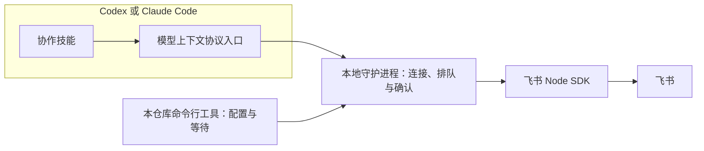
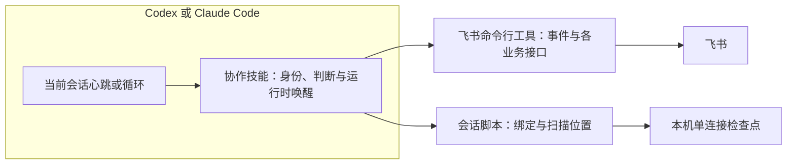
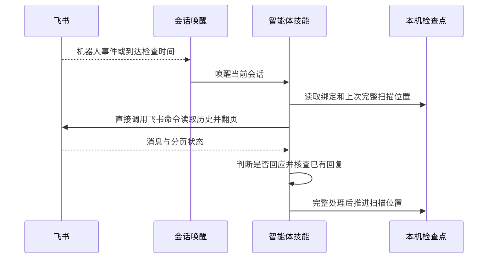

# 架构设计：以飞书命令行工具和技能替换专用服务

## 1. 人工评审重点

- **评审状态**：待人工确认；不得据此开始代码替换。
- **核心决定**：插件以 `lark-cli` 作为唯一飞书接口；机器人活跃会话使用消息事件，机器人和用户身份的无人值守阶段都从目标聊天历史补查。技能直接组合飞书命令，仅用一个本地脚本保存会话绑定与扫描位置，不再发布自己的命令行工具、守护进程或模型上下文协议服务。
- **状态归属**：单连接关系和上次完整处理到的扫描位置保存在本机一个不含凭据的状态文件中。消息内容、回复命令及处理判断留在智能体会话与飞书，不建立本机消息台账。
- **运行时归属**：Codex 使用当前会话的心跳自动化唤醒；Claude Code 使用当前会话的 `/loop`。脚本只检查飞书和管理本机检查点，不自建常驻进程或唤醒服务。
- **首要风险**：用户身份无消息事件；飞书历史接口可能拒绝部分群或漏掉话题回复。设计要求连接前验证读取能力，话题群采用能覆盖回复的查询，查询不完整时报告中断。
- **需要确认**：收缩后的单脚本边界、旧 npm 命令行停止更新，以及不能安全判定发送结果时暂停自动重发并核查飞书原消息的处理方式。

## 2. 架构总览

### 2.1 当前架构现状

当前插件通过本仓库的命令行工具启动守护进程，再由模型上下文协议工具把飞书消息投递给智能体。



#### 2.1.1 当前目录结构

```text
src/cli.js                    自有命令行入口
src/config.js                 本仓库应用凭据
src/daemon/                   绑定、队列、等待、去重、日志
src/lark/                     飞书接口与长连接
src/mcp/server.js             模型上下文协议工具
plugins/lark-connect/         双运行时插件、模型上下文协议描述与技能
tests/                        各旧模块和插件载荷测试
```

#### 2.1.2 当前事实依据

- `src/daemon/runtime.js` 以进程内映射保存唯一绑定、已见消息、队列、等待者及确认状态；进程重启会丢失这些信息。
- `src/cli.js` 提供配置、诊断、等待、日志和服务管理；`src/mcp/server.js` 声明 14 个工具，均依赖本仓库服务路径。
- `plugins/lark-connect/.codex-plugin/plugin.json`、`plugins/lark-connect/codex.mcp.json` 和 `plugins/lark-connect/.mcp.json` 将插件接到该服务；两个技能均按旧入口编排。
- `AGENTS.md` 当前规定正式路径不得依赖 `lark-cli`，并规定旧配置与发布方式。实施本设计时必须同步修订这些已失效的工程约束。

### 2.2 目标设计概览

插件技能选择身份、读取与回复消息，并使用 `lark-cli` 完成全部飞书操作；唯一的本地脚本只连接智能体会话与目标聊天，并保存跨唤醒扫描位置。



#### 2.2.1 设计边界

- **目标**：两种身份都可进入一个目标聊天、发现新消息、按规则处理并在原消息下回复；无人值守空窗可补查且重复检查不自动重发。
- **非目标**：自建飞书通用接口、常驻守护进程、跨机器协调、迁移旧密钥、一次连接多个聊天。
- **约束与不变量**：所有飞书调用都显式携带配置档案和 `--as` 身份；状态文件无凭据、聊天正文或逐消息处理记录；当前机器仅允许一个有效连接。用户身份检查选定聊天的全部新消息，智能体决定是否回复；机器人群聊只处理结构化提及，机器人单聊处理全部新消息。两种身份均不得把自己生成的回复再次当成任务。
- **兼容行为**：聊天查找、机器人单聊发现、上下文、成员、附件、原消息回复、提及、`OK` 确认以及 Codex 和 Claude Code 持续响应。

#### 2.2.2 目标目录结构

```text
plugins/lark-connect/
├── .codex-plugin/plugin.json               （改：移除模型上下文协议服务）
├── .claude-plugin/plugin.json              （改：描述技能能力）
└── skills/
    └── lark-chat-session/
        ├── SKILL.md                        （改：官方配置、双身份和唤醒流程）
        └── scripts/session.mjs             （新增：绑定与扫描位置）
tests/
├── session.test.mjs                        （新增：绑定与检查点契约）
└── plugin-packaging.test.mjs               （改：纯技能载荷）
src/                                        （删除：旧命令行、守护进程、SDK 与模型上下文协议）
```

`package.json` 仅作为本仓库的私有开发和测试清单保留，不再包含可发布的命令行入口或飞书 SDK 依赖；市场清单继续提供双运行时插件。具体旧文件处置见第 4 节。

#### 2.2.3 脚本边界

`session.mjs` 随技能分发，不注册全局命令，也不调用飞书接口。它只管理一个本机会话绑定和扫描位置，输出一份 JSON；聊天查找、消息事件、历史分页、上下文、回复、媒体上传及完成反应都由智能体直接调用 `lark-cli`。技能每次从绑定中取得配置档案和身份，并在飞书命令中显式传 `--profile` 与 `--as`。具体输入输出见 `3.1.2.1`。

### 2.3 共享模型设计

#### 2.3.1 模型总表

| 模型 | 变更状态 | 代码或存储映射 |
|---|---|---|
| `ConnectionCheckpoint` | 本次新增 | `plugins/lark-connect/skills/lark-chat-session/scripts/session.mjs` 管理的本机 JSON 状态文件 |
| `Binding` | 计划移除 | `src/daemon/runtime.js` 的进程内绑定，改由 `ConnectionCheckpoint` 承接 |

#### 2.3.2 模型详情

##### 2.3.2.1 `ConnectionCheckpoint`

- **承接需求**：`2.1`、`2.2`、`2.4`、`2.6`；尤其是单连接与无人值守恢复。
- **职责与行为**：记录配置档案、身份、目标聊天、智能体运行时与会话标识、连接代次及上次完整处理的扫描位置。不保存令牌、应用密钥、聊天正文或逐消息状态。默认位于 `${XDG_STATE_HOME:-~/.local/state}/lark-connect/connection.json`，文件权限限当前用户。脚本读写时校验会话标识与代次，避免旧心跳在切换后处理新聊天。
- **设计理由**：没有常驻进程时，跨智能体唤醒必须保留最小检查点；一个本机文件足够承接当前单连接约束，数据库和通用存储层没有收益。
- **同一性判断**：本机唯一活动连接；每次显式接管生成新的连接代次。
- **状态与存续范围**：连接时原子写入，完成一轮消息判断后推进扫描位置，停止时标为停止并撤销运行时唤醒；权限仅当前用户可读写。
- **有效状态规则**：同一机器至多一个活动连接；检查点的身份、聊天与会话标识必须一起匹配后才能读取或写入消息（每次脚本调用时）。

## 3. 分项设计

### 3.1 身份、连接与聊天能力

#### 3.1.1 原始需求

- `spec.md#2.1`、`VAL-IDENTITY-001～003`：配置档案和机器人或用户身份贯穿一次协作，不静默切换。
- `spec.md#2.2`、`VAL-CHAT-001～005`：明确查找、选择和连接一个目标聊天，支持两种身份的群聊与单聊。
- `spec.md#2.5`、`VAL-OPERATIONS-001`：其他飞书操作按需使用上游能力，不逐项自建接口。

#### 3.1.2 设计

`lark-chat-session` 技能引导用户使用 `lark-cli` 创建机器人配置、登录用户并授权。技能先显示配置档案及身份，再用 `lark-cli im +chat-search` 查群、用户身份用 `+chat-list --types p2p,group` 查单聊。机器人单聊不可直接列举时，使用带唯一文本的短时机器人消息事件确认目标；候选歧义交给用户选择。智能体直接用所选身份验证目标聊天可读，再调用 `session.mjs start` 保存绑定；权限拒绝和平台限制都显示为连接失败。上下文、成员、资源以及非聊天飞书操作直接按 `lark-cli` 对应技能和命令执行。

##### 3.1.2.1 接口设计

###### 3.1.2.1.1 `session.mjs`（插件脚本）

- **使用方**：两个智能体运行时中的 `lark-chat-session` 技能。
- **设计理由**：一个短脚本集中执行单连接与跨唤醒扫描位置校验；它不解析飞书消息，也不包装飞书读写命令。
- **输入与输出**：

| 动作 | 输入 | JSON 输出 | 本机副作用 |
|---|---|---|---|
| `start` | `--profile <名称> --as bot\|user --chat-id <标识> --runtime codex\|claude-code --session-id <稳定标识> [--replace]` | `{"ok":true,"connection":{"status":"active","profile":"team-bot","as":"bot","chatId":"oc_...","runtime":"codex","sessionId":"...","generation":"...","scanThrough":"..."}}` | 写入唯一活动绑定，扫描起点设为开始连接前的时间 |
| `status` | 无必需参数 | 当前绑定摘要及扫描位置；无活动绑定时返回 `stopped` | 无 |
| `checkpoint` | `--session-id <标识> --generation <代次> --through <时间>` | `{"ok":true,"scanThrough":"..."}` | 只允许当前会话把完整处理过的扫描位置向前推进 |
| `stop` | `--session-id <标识> --generation <代次>` | `{"ok":true,"status":"stopped"}` | 停止当前绑定；技能撤销对应的运行时唤醒 |

- **错误与副作用边界**：已有绑定且未显式接管、会话或代次不匹配、扫描位置倒退时，返回 `{"ok":false,"code":"...","message":"..."}` 并以非零退出；原绑定保持不变。脚本不核验聊天权限，技能必须在 `start` 之前用 `lark-cli` 完成真实可读性检查。它不保存凭据或消息正文。

#### 3.1.3 验证

- `VAL-IDENTITY-001～003`、`VAL-CHAT-001～005`、`VAL-OPERATIONS-001`：模拟命令行输出检查身份与失败分支；在真实测试聊天验证群聊、单聊和非聊天只读操作。

### 3.2 事件、补查与无人值守唤醒

#### 3.2.1 原始需求

- `spec.md#2.3`、`VAL-MESSAGE-001`、`VAL-MESSAGE-005～006`：机器人按提及或单聊规则接收；用户身份检查所选聊天的全部新消息并按需回复，不能形成循环。
- `spec.md#2.4`、`VAL-CONTINUITY-001～004`：活跃与无人值守时持续发现消息，空窗可补查且不重复。

#### 3.2.2 设计

机器人活跃会话可直接运行一次有界 `lark-cli event consume im.message.receive_v1 --as bot --max-events 1 --timeout 60s`，取得候选事件；事件超时不停止连接。用户身份没有此事件，活跃阶段直接检查聊天历史。无人值守时，Codex 当前会话心跳和 Claude Code `/loop` 唤醒同一智能体会话，由智能体读取 `session.mjs status`，再以其中的配置档案、身份和聊天标识调用 `lark-cli`。技能在开始持续响应时设定唤醒，在停止时撤销。

智能体从 `scanThrough` 稍早的位置重叠读取目标聊天历史，按飞书消息标识去重，完整翻页并逐条判断后才调用 `session.mjs checkpoint` 推进位置。机器人群聊用结构化提及判断是否交给会话；机器人单聊与用户身份的选定聊天都查看全部新消息。用户身份下，不能仅按发送者是否为本人排除消息；智能体自己的回复通过原消息关系和本轮返回的回复标识识别。话题群若普通快捷命令不能覆盖旧话题回复，使用 `lark-cli api GET /open-apis/im/v1/messages` 并明确包含话题回复；无法证明完整性时报告该群不支持可靠持续响应。分页未尽、授权拒绝、发送结果不明或会话中断时不推进扫描位置，下次重新检查飞书历史后再继续。

#### 3.2.3 流程与必要图示



**图示说明与设计理由**：事件只用于降低机器人身份活跃时的延迟；历史是恢复空窗的共同依据。智能体负责理解消息和分页结果，本地脚本只保留下一次唤醒所需的绑定与位置。只有完整查询和本轮处理结束后才能推进检查点，避免把部分结果误判为没有新消息。

#### 3.2.4 验证

- `VAL-MESSAGE-001`、`VAL-MESSAGE-005～006`、`VAL-CONTINUITY-001～004`：用技能演练覆盖群聊提及、单聊、用户身份普通消息、重复事件、分页、话题回复、不可读群和真实无人值守唤醒；脚本测试只覆盖绑定和扫描位置。

### 3.3 回复、附件与确认

#### 3.3.1 原始需求

- `spec.md#2.3`、`VAL-MESSAGE-002～005`：读上下文与附件，在原消息下回复文本或媒体，可提及协作者，并在成功后添加 `OK` 反应；部分失败可恢复且不重复回复。

#### 3.3.2 设计

技能直接调用 `lark-cli` 读取原消息、上下文、资源和成员，确认当前会话的 `generation` 仍有效后，使用 `lark-cli im +messages-reply --profile <已绑定档案> --as <已绑定身份> --message-id <原消息标识>` 回复。文本、富文本、图片、文件和视频沿用上游参数；需要多个产物时逐条回复原消息，并为每一条选择稳定且不同的幂等键。媒体路径按上游规则从文件所在目录传相对路径；视频和封面不在同一目录时由智能体准备临时目录。额外提及按上游文本或富文本格式构造，目标标识先从成员或上下文核实。

回复前，智能体从飞书原消息的回复关系和当前身份的 `OK` 反应核查是否已经处理；已发送的部分不重发。回复成功后用 `lark-cli im reactions create` 给原消息添加 `OK` 反应。若回复成功而反应失败，只补反应。若发送命令超时或返回含糊，先从飞书重新读取原消息附近的回复核查；无法确认有无发送时暂停自动重发并告知会话主人。飞书幂等键只保护有限时间，不能代替远端核查。用户身份下，选定聊天的所有新消息都要交给智能体判断，但无需回应的消息不发送回复或反应；智能体自己的回复通过回复关系识别，不能仅按发送者过滤。

#### 3.3.3 验证

- `VAL-MESSAGE-002～005`：用技能演练成功、已发送但确认失败、发送超时及重复检查；真实飞书测试文本、附件、提及与原消息关系。检查上游命令的实际输入输出，不维护本地发送接口的镜像测试。

### 3.4 安装、发布与旧路径退场

#### 3.4.1 原始需求

- `spec.md#2.6`、`VAL-INSTALLATION-001～003`：不依赖旧服务，用户自行通过官方命令行工具配置身份，两种运行时可使用并可从旧版切换。

#### 3.4.2 设计

插件市场仍指向 `plugins/lark-connect/`，但 Codex 清单去掉 `mcpServers`，两个模型上下文协议描述文件删除。单个技能使用官方命令行工具，并按需调用随技能分发的会话脚本；清单与市场说明同步改版。本仓库 `package.json` 改为私有测试清单，发布工作流仅验证并创建插件的 GitHub Release，停止 npm 发布；已有已发布 npm 版本留在 npm 供旧连接回退，不自动卸载或清理旧凭据。历史研究文档保留并标注已被本设计取代，避免把旧研究结论误认为现行结构。相同机器人切换前必须停止旧守护进程和旧会话，验证新身份及聊天后才显示连接成功。

#### 3.4.3 验证

- `VAL-INSTALLATION-001～003`：干净插件安装检查没有旧模型上下文协议入口；Codex 和 Claude Code 分别执行真实连接与停止；旧连接切换失败后能够手动回退。

## 4. 迁移与行为保护

- **迁移方式**：受控的显式切换；同一个机器人不同时运行新旧接收者。新插件发布前旧版本继续可用，不引入永久双路径。
- **中间状态与兼容窗口**：本 PR 草稿期间市场仍指向旧发布版本；开发分支可用测试配置档案验证新路径。新版本发布后旧 npm 版本保留供人工回退。
- **切换信号**：22 项验收契约的适用测试通过，两种运行时的代表性真实消息往返、空窗补查和停止验证完成；不足的能力如实标记不可用。
- **行为保护**：旧模块测试退场后，以会话脚本和插件载荷契约测试保护绑定、代次、检查点与双运行时安装；身份、消息过滤、回复、媒体及重复处理通过技能演练和真实飞书验收证明，不复制 `lark-cli` 的内部测试。
- **回滚条件**：出现重复回复、静默漏消息、错误身份写入或运行时无法唤醒时停止新连接，旧版本与旧配置由用户手动重新启用。
- **旧路径删除条件**：新的行为保护和真实验收成立后，本 PR 才移除旧源代码与发布入口；不在新插件里长期维护两套路径。
- **负责人**：本 PR 实施者跟踪退场，用户决定实际安装切换与发布。

### 4.1 资产退场清单

以下从 `src/cli.js`、`src/daemon/`、`src/lark/`、`src/mcp/` 的导入与测试引用，以及插件清单、README、工程规则和工作流反查到本次 PR 的活跃资产。`docs/worklog/` 是历史归档，保留原貌。

| 准确路径 | 当前依赖证据 | 处置与理由 |
|---|---|---|
| `src/cli.js` | `package.json` 的 `bin`、旧 README、命令行测试 | 删除；官方命令行工具承接 |
| `src/config.js` | `src/cli.js`、服务、配置测试 | 删除；用户自行配置官方档案 |
| `src/daemon/errors.js` | 守护进程与服务测试 | 删除；无旧服务错误契约 |
| `src/daemon/http-client.js` | 命令行、模型上下文协议与测试 | 删除；不再进程间转发 |
| `src/daemon/http-server.js` | 守护进程与测试 | 删除；不再提供本地服务 |
| `src/daemon/logger.js` | 守护进程与测试 | 删除；技能依据飞书命令结果和会话状态排查 |
| `src/daemon/runner.js` | 命令行与测试 | 删除；不再启动常驻进程 |
| `src/daemon/runtime.js` | 守护进程路由与测试 | 删除；单连接检查点承接必要状态 |
| `src/lark/channel-runner.js` | 守护进程与测试 | 删除；官方事件命令承接 |
| `src/lark/channel.js` | 长连接与测试 | 删除；官方事件命令承接 |
| `src/lark/chat-context.js` | 守护进程与测试 | 删除；官方历史命令承接 |
| `src/lark/chat-members.js` | 守护进程与测试 | 删除；官方成员命令承接 |
| `src/lark/chats.js` | 守护进程与测试 | 删除；官方聊天命令承接 |
| `src/lark/doctor.js` | 命令行与测试 | 删除；技能直接用飞书命令验证身份与聊天 |
| `src/lark/listener.js` | 命令行与测试 | 删除；官方事件命令承接 |
| `src/lark/mentions.js` | 消息发送与测试 | 删除；官方回复命令承接 |
| `src/lark/messages.js` | 守护进程与测试 | 删除；官方回复命令承接 |
| `src/lark/reactions.js` | 守护进程与测试 | 删除；官方反应接口承接 |
| `src/lark/resources.js` | 守护进程与测试 | 删除；官方资源命令承接 |
| `src/lark/timeouts.js` | 长连接与测试 | 删除；上游事件命令有界运行 |
| `src/mcp/server.js` | `src/cli.js`、插件描述与测试 | 删除；技能直接调用 |
| `plugins/lark-connect/.mcp.json` | Claude Code 插件服务注册 | 删除；纯技能插件 |
| `plugins/lark-connect/codex.mcp.json` | Codex 插件服务注册 | 删除；纯技能插件 |
| `plugins/lark-connect/.codex-plugin/plugin.json` | Codex 技能与服务清单 | 修改；移除服务并更新描述与版本 |
| `plugins/lark-connect/.claude-plugin/plugin.json` | Claude Code 插件清单 | 修改；更新描述与版本 |
| `plugins/lark-connect/skills/lark-chat-session/SKILL.md` | 旧工具调用流程 | 重写；双身份与官方命令流程 |
| `plugins/lark-connect/skills/lark-connect-setup/SKILL.md` | 旧配置与服务流程 | 删除；官方配置引导合入主技能 |
| `plugins/lark-connect/skills/lark-chat-session/agents/openai.yaml` | Codex 技能展示 | 修改；更新说明，保留英文展示名 |
| `plugins/lark-connect/skills/lark-connect-setup/agents/openai.yaml` | Codex 配置技能展示 | 删除；仅保留主技能入口 |
| `.agents/plugins/marketplace.json` | Codex 市场版本与描述 | 修改；同步新载荷 |
| `.claude-plugin/marketplace.json` | Claude Code 市场版本与描述 | 修改；同步新载荷 |
| `README.md` | 全篇旧安装、服务和工具流程 | 重写；新旧切换和验证 |
| `AGENTS.md` | 旧 SDK、服务、测试与发布约束 | 修改工程专属区块；受管区块不改 |
| `package.json` | 旧 npm 包、依赖和质量命令 | 修改为私有测试清单；移除 `bin` 与 SDK |
| `package-lock.json` | 旧依赖锁定 | 修改；仅保留测试依赖 |
| `eslint.config.js` | 旧 `src` 与命令行规则 | 修改；检查技能脚本与新测试 |
| `.github/workflows/quality.yml` | 旧 npm 包质量门禁 | 修改；运行新脚本测试与插件检查 |
| `.github/workflows/release.yml` | npm Trusted Publishing 与 GitHub Release | 修改；停止 npm 发布，保留插件版本的 GitHub Release |
| `tests/channel-runner.test.mjs` | 旧长连接测试 | 删除；由上游事件命令与真实验收代替 |
| `tests/channel.test.mjs` | 旧长连接测试 | 删除；同上 |
| `tests/chat-context.test.mjs` | 旧上下文测试 | 删除；上游接口与真实验收代替 |
| `tests/chat-members.test.mjs` | 旧成员测试 | 删除；上游接口与真实验收代替 |
| `tests/chats.test.mjs` | 旧聊天搜索测试 | 删除；上游接口与真实验收代替 |
| `tests/cli.test.mjs` | 旧命令行测试 | 删除；命令行退场 |
| `tests/config.test.mjs` | 旧配置测试 | 删除；官方档案承接 |
| `tests/daemon-http.test.mjs` | 旧服务测试 | 删除；服务退场 |
| `tests/daemon-logger.test.mjs` | 旧日志测试 | 删除；服务退场 |
| `tests/daemon-runner.test.mjs` | 旧守护进程测试 | 删除；守护进程退场 |
| `tests/daemon-runtime.test.mjs` | 旧队列测试 | 删除；会话绑定与检查点测试代替 |
| `tests/doctor.test.mjs` | 旧诊断测试 | 删除；连接验证代替 |
| `tests/lint-config.test.mjs` | 旧检查规则测试 | 修改；适配脚本目录 |
| `tests/listener.test.mjs` | 旧监听测试 | 删除；官方事件与补查代替 |
| `tests/mcp-daemon.test.mjs` | 旧服务工具测试 | 删除；服务退场 |
| `tests/mcp.test.mjs` | 旧协议测试 | 删除；协议入口退场 |
| `tests/messages.test.mjs` | 旧发送测试 | 删除；上游回复命令与真实飞书验收代替 |
| `tests/package-contract.test.mjs` | 旧 npm 发布契约 | 修改；改为私有测试清单契约 |
| `tests/plugin-packaging.test.mjs` | 旧模型上下文协议载荷契约 | 修改；改为技能脚本载荷契约 |
| `tests/quality-workflow.test.mjs` | 旧质量门禁契约 | 修改；检查新门禁 |
| `tests/reactions.test.mjs` | 旧反应测试 | 删除；上游反应命令与真实飞书验收代替 |
| `tests/resources.test.mjs` | 旧资源测试 | 删除；上游接口与真实验收代替 |
| `docs/research/lark-agent-bridge.md` | 旧 SDK 优先的探索性研究 | 保留并标注历史，不作为现行实现指引 |

## 5. 质量风险与保障

| 风险维度 | 风险与影响 | 保障方式 | 验证方式与通过标准 |
|---|---|---|---|
| 完整性 | 用户身份轮询、话题群时间窗查询或分页截断漏掉消息 | 完整翻页且判断结束才推进检查点；话题群使用包含回复的查询；权限受限时不激活持续响应 | 技能演练旧话题新回复、分页与授权失败；真实空窗补查仅回复一次 |
| 重复写入 | 智能体唤醒重叠或发送结果不明造成重复回复 | 单连接代次校验、飞书原消息回复与反应核查、上游幂等键；不确定时暂停重发 | 会话代次测试与真实发送超时恢复演练；重复检查无第二条回复 |
| 身份与隐私 | 默认档案或身份漂移、状态文件泄露聊天正文 | 每次显式传档案与身份；状态文件只含标识与时间且限当前用户读写 | 命令调用断言、状态文件内容与权限检查 |
| 可用性 | 本机或运行时关闭后不能唤醒 | 开始时说明运行条件；恢复后补查可读取历史；失败报告空窗 | Codex、Claude Code 各自真实唤醒与停止验收 |

## 6. 可观测设计

`session.mjs` 在标准输出返回绑定和扫描位置，失败时给出明确原因；飞书调用的结果与错误直接来自 `lark-cli`。状态文件不写聊天正文；不再维护一套守护进程日志。技能把检查中断、未推进位置和发送待核查状态明确告诉会话主人。

## 7. 部署与运行

双运行时插件从仓库市场载荷安装，运行节点是拥有 `lark-cli` 配置档案的本机。技能脚本随插件分发，不安装本仓库命令行工具。Codex 心跳与 Claude Code `/loop` 必须在相应本地运行时可用时才能唤醒当前会话；两者都停摆时只保留后续补查能力。旧版配置留在原位置，由用户按官方引导创建新档案并手动停止旧机器人连接。

## 8. 人工确认结果

用户于 2026 年 9 月 22 日要求按此架构开始实施。此前已确认的产品决定：两种身份都要持续响应；用户身份检查选定聊天的全部新消息并按需回复；旧凭据不迁移；聊天协作为插件核心。用户在审查中进一步要求避免过度封装飞书命令行工具，本设计已收缩为单个会话与扫描位置脚本。

## 9. 参考依据

| 来源 | 关键依据 | 设计落点 |
|---|---|---|
| `spec.md`、`validation-contract.md` | 2.1～2.6、22 项验收断言 | 2.2、3.1～3.4、4、5 |
| `AGENTS.md` | 当前 SDK 优先、旧配置、单连接、测试与发布规则 | 2.1、2.2、3.4、4.1 |
| `src/daemon/runtime.js`、`src/cli.js`、`src/mcp/server.js` | 旧状态、入口和工具职责 | 2.1、2.3、3、4.1 |
| `plugins/lark-connect/` 与两份市场清单 | 双运行时入口与技能载荷 | 2.2、3.4、4.1 |
| [飞书命令行工具事件说明](https://github.com/larksuite/cli/blob/main/skills/lark-event/SKILL.md) | 机器人消息事件及有界消费 | 3.2 |
| [飞书命令行工具聊天历史说明](https://github.com/larksuite/cli/blob/main/skills/lark-im/references/lark-im-chat-messages-list.md) | 两种身份的历史读取 | 3.1、3.2 |
| [话题群遗漏问题](https://github.com/larksuite/cli/issues/2074)、[跨组织群限制](https://github.com/larksuite/cli/issues/739) | 轮询完整性与可用边界 | 3.2、5 |
| [Codex 计划任务](https://developers.openai.com/zh-Hans/docs/automations)、[Claude Code `/loop`](https://code.claude.com/docs/zh-CN/commands) | 当前会话的周期唤醒能力及运行条件 | 3.2、7 |
