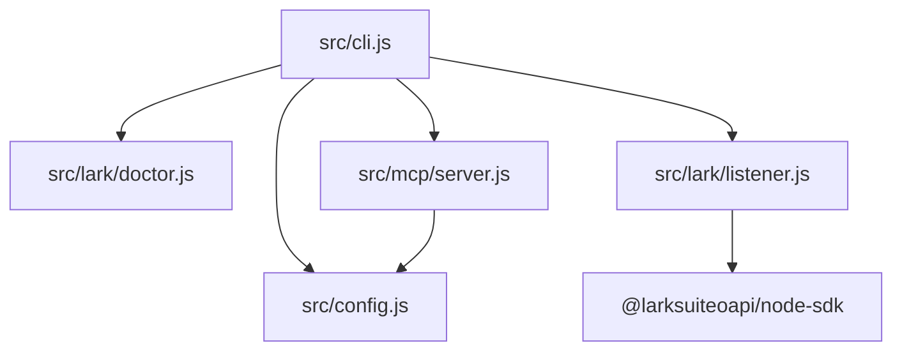
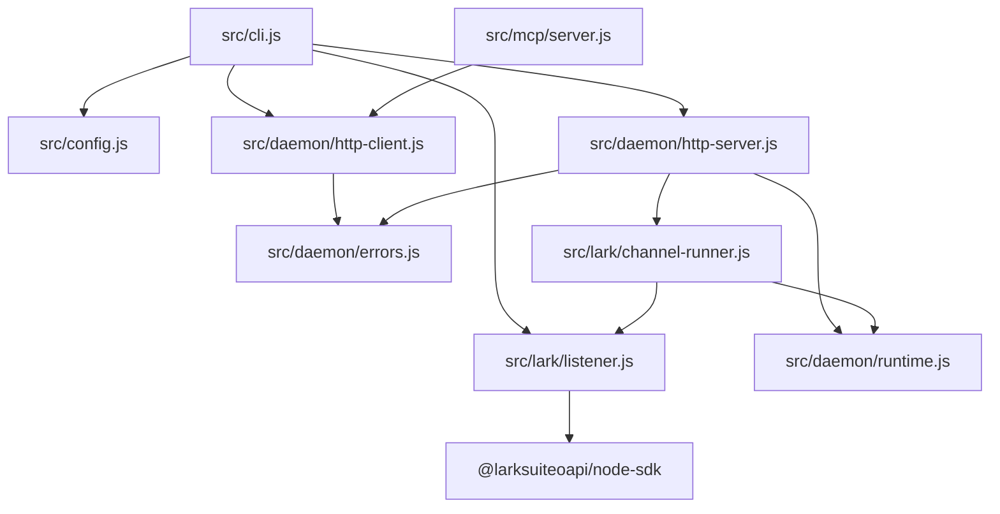

# 架构设计:lark-daemon-session-binding

## Context & Current State / 背景与现状

本设计承接 `docs/specs/lark-daemon-session-binding/spec.md`：第一版要让本地守护进程持续监听飞书群 mention，再由当前 Codex 或 Claude Code 会话通过 MCP 绑定、领取和确认消息。

当前代码已经有三个接入面：

- [src/cli.js](src/cli.js)：命令入口，已有 `setup`、`config`、`doctor`、`listen --once`、`daemon`、`mcp`。
- [src/lark/listener.js](src/lark/listener.js)：一次性长连接监听，能创建 `node-sdk Channel`，等待目标群下一条机器人提及。
- [src/mcp/server.js](src/mcp/server.js)：MCP 标准输入输出服务，暴露 daemon 绑定、消息收发、资源下载等工具。

缺口是：没有常驻进程、没有本地 HTTP 接口、没有群与 Agent 会话绑定、没有消息队列和确认语义。仓库当前没有 `docs/rules/arch/`，无项目专属架构规则。



## Design Drivers & Constraints / 设计驱动与约束

**设计驱动**

- 简单性 — 第一版明确不持久化、不补历史、不支持多绑定，模块数要控制在能跑通闭环的最小集合。
- 可测试性 — 绑定冲突、消息状态、确认语义和空闲退出不能依赖真实飞书才能验证，核心状态机必须可单元测试。
- 明确生命周期 — MCP 不自动启动守护进程，daemon 空闲 1 小时自动退出，这些行为必须在边界上清晰可见。
- 影响半径 — 保留现有 `listen --once` 调试路径，新增主路径不要破坏已有 CLI 和 MCP 基础能力。

**约束与不变量**

- `listen --once` 继续作为直接长连接调试命令，不依赖守护进程。
- 守护进程状态只存在内存中，退出或重启后全部丢弃。
- 同一个 `chat_id` 同一时间只能有一个活跃绑定。
- MCP 工具不得自动启动守护进程；daemon 不在线时必须返回 `DAEMON_NOT_RUNNING`。
- 本地 HTTP 只能监听本机回环地址，不引入公网服务。
- 飞书 `rootId`、`threadId`、`replyToMessageId` 只作为消息元数据，不参与第一版主路由。

## Candidate Approaches / 候选方案

### 候选 A:内存运行时核心 + 本地 HTTP 边界

- **形状**: 新增一个纯内存 daemon runtime，负责绑定、队列、去重、空闲时间和消息状态；本地 HTTP server 只把请求转成 runtime 调用；MCP 和 CLI 通过本地 HTTP client 调 daemon。飞书长连接适配器把 `node-sdk Channel` 的事件送进 runtime。
- **优点**: 状态机可以不启动 HTTP 和飞书就测试；HTTP、MCP、CLI 都是薄适配层；后续要换通信协议或加发送能力时，核心语义不漂移。
- **缺点**: 比把逻辑直接写在 HTTP 路由里多一层模块边界。

### 候选 B:HTTP 路由直接持有状态

- **形状**: daemon 启动一个本地 HTTP server，路由处理器直接维护 `Map`、飞书连接和消息队列；MCP 和 CLI 通过 HTTP 调用。
- **优点**: 新文件数量最少，初期能很快写出端到端路径。
- **缺点**: 绑定、队列、空闲退出和飞书事件处理会混在路由层；单元测试容易变成 HTTP 测试；后续 MCP 工具增多时路由层会变成事实上的上帝模块。

### 候选 C:daemon 调用 `lark-cli event consume`

- **形状**: daemon 不直接使用 `node-sdk Channel`，而是启动 `lark-cli event consume` 子进程读取事件，再把事件写入本地队列。
- **优点**: 可以复用已经跑通的 `lark-cli` 烟雾测试路径，飞书协议接入代码更少。
- **缺点**: `lark-cli event` 输出是简化事件，缺少完整 `mentions`、`rootId`、`threadId` 等字段；子进程生命周期和错误处理会增加额外不确定性；核心运行时依赖外部 CLI 版本。

## Tradeoff Comparison / 权衡对比

| 驱动 | 候选 A | 候选 B | 候选 C |
|---|---|---|---|
| 简单性 | 多一个 runtime 模块，但状态语义集中，调用面清楚 | 文件少，但路由、状态和飞书事件混在一起 | 代码少一部分，但多一个外部子进程和版本前提 |
| 可测试性 | 绑定、队列、确认、空闲退出都能用 `node:test` 单测 | 大量行为要通过 HTTP 路由间接验证 | 需要模拟 CLI 子进程输出和异常，测试接缝更脆 |
| 明确生命周期 | daemon runtime 管空闲退出，HTTP/MCP 只刷新活动时间 | 空闲逻辑散在路由和事件处理里 | 还要处理子进程退出、重启和管道阻塞 |
| 影响半径 | 保留 `listen --once`，新增 daemon 路径独立接入 | 容易把 `listen --once` 的监听逻辑复制或改坏 | 会让核心路径依赖 `lark-cli`，弱化已接入的 `node-sdk Channel` |

## Decision & Rationale / 选定方案与理由

- **选定**: 候选 A，内存运行时核心 + 本地 HTTP 边界。
- **决定它的驱动**: 可测试性和明确生命周期。核心状态机是这个功能最容易出错的部分，必须能脱离飞书和 HTTP 验证。
- **放弃了什么**: 相比候选 B，多了少量模块文件；相比候选 C，不复用 `lark-cli event consume` 作为核心运行时。
- **否决理由**: 候选 B 会让路由层承载过多状态语义；候选 C 的事件字段和子进程生命周期不适合作为核心契约。

## Target Structure / 目标结构

**目录概览**

```text
src/
  cli.js                         (改) 增加 daemon start/status/stop，调用本地 HTTP client
  config.js                      (改) 增加 daemon host/port/idle timeout 配置解析
  daemon/                        (新增)
    runtime.js                   (新增) 内存绑定、队列、去重、活动时间、消息状态
    http-server.js               (新增) 本地 HTTP server 和路由
    http-client.js               (新增) MCP/CLI 调 daemon 的客户端
    errors.js                    (新增) 统一错误码和错误响应
  lark/
    listener.js                  (改) 保留 listenOnce，抽出可复用消息归一化和 channel 创建
    channel-runner.js            (新增) daemon 持续连接飞书并把事件送入 runtime
  mcp/
    server.js                    (改) 增加绑定、轮询、等待、确认、状态工具，调用 daemon client
tests/
  daemon-runtime.test.mjs        (新增)
  daemon-http.test.mjs           (新增)
  mcp-daemon.test.mjs            (新增)
  cli-daemon.test.mjs            (新增)
```

**模块依赖图**



**本地 HTTP 契约**

第一版本地 HTTP 只作为本机协议边界，不对外承诺公网 API。建议资源形态如下：

```text
GET  /health
GET  /status
POST /bindings
GET  /sessions/:agent_session_id/messages
GET  /sessions/:agent_session_id/messages/wait?timeout_ms=...
POST /messages/:message_id/ack
```

所有依赖 daemon 的 MCP 工具通过 `http-client` 访问这些端点。连接失败统一映射为：

```json
{
  "code": "DAEMON_NOT_RUNNING",
  "message": "lark-connect daemon is not running. Start it with: curiosea-lark-connect daemon start",
  "command": "curiosea-lark-connect daemon start"
}
```

**核心运行时概念**

```text
Binding:
  chatId
  agentKind
  agentSessionId
  workspace
  createdAt

Message:
  id
  larkMessageId
  chatId
  agentSessionId
  status: pending | delivered | acknowledged
  payload
  receivedAt
  deliveredAt?
  acknowledgedAt?
```

runtime 负责以下不变量：

- 一个 `chatId` 最多一个 Binding。
- 替换 Binding 时，旧 `agentSessionId` 的未确认消息被删除。
- 无 Binding 的消息不投递给任何会话。
- `poll` 只返回该 `agentSessionId` 的消息。
- `ack` 只能确认 runtime 已知且已投递或待领取的消息。

## Risks & Rollback / 风险与回滚

- **风险**: daemon 真实长连接与测试里的假通道行为不一致 → **缓解**: `channel-runner` 只依赖 `on/connect/disconnect` 这类窄接口，保留真实群手动验证。
- **风险**: 空闲退出测试如果绑定真实 1 小时会拖慢测试 → **缓解**: runtime 接收可配置空闲时间和可控时钟。
- **风险**: 固定端口被占用 → **缓解**: 配置允许覆盖端口；`daemon start` 在端口占用时给出明确错误。
- **回滚**: 新增 daemon/MCP 工具路径与 `listen --once` 分离；如果 daemon 路径回滚，保留当前一次性监听和 doctor 能力。

## Cross-Module Impact / 对其他模块的影响

- [src/cli.js](src/cli.js) — 增加 daemon 子命令，并接入 daemon HTTP client。
- [src/mcp/server.js](src/mcp/server.js) — 扩展工具列表和工具调用分发，仅保留会话协作相关工具。
- [src/lark/listener.js](src/lark/listener.js) — 抽出消息归一化和 channel 创建，供一次性监听和 daemon 长连接复用。
- `tests/` — 新增 runtime、HTTP、MCP 和 CLI 层测试，覆盖 `validation-contract.md` 中的断言。

## Consequences / 后果

- **得到的**: 飞书连接生命周期和 Agent 会话消费解耦；核心状态语义可单元测试；MCP 工具不需要知道飞书 SDK 细节。
- **要承受的**: 第一版多一个本地 HTTP 进程和端口管理；没有持久化意味着 daemon 重启后用户必须重新绑定。
- **需要后续跟进的**: 出站消息和产物发送需要独立扩展；如果未来允许同群多会话绑定，再引入飞书线程元数据路由。

## Open Questions / 未决问题

- 默认端口、端口冲突提示文案、是否提供 token 鉴权留给实现阶段在不改变契约的前提下决定。
