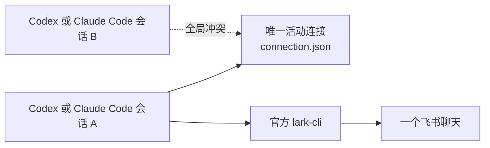
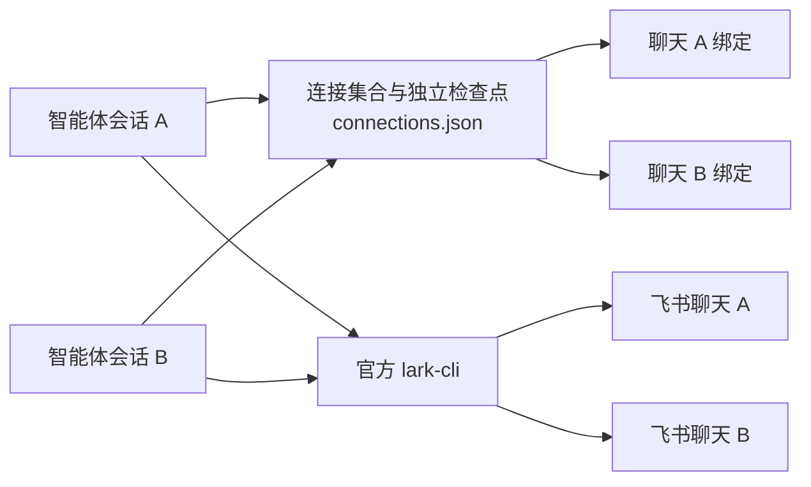
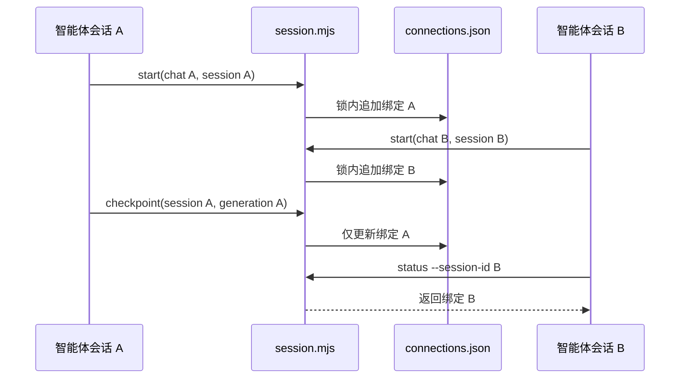
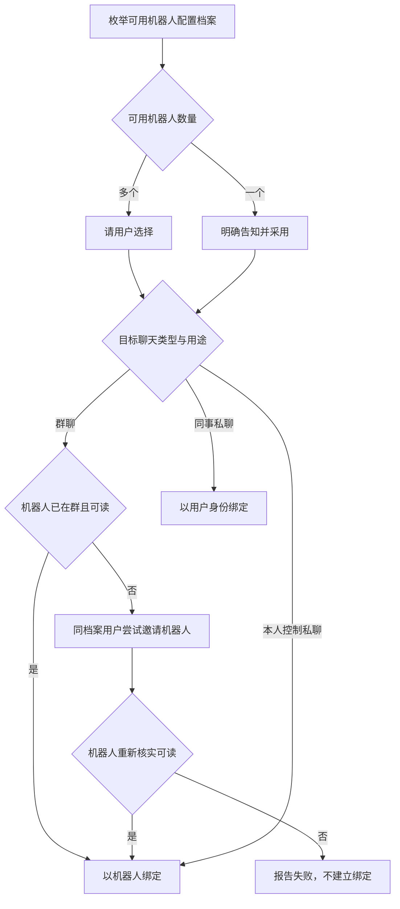

# 架构设计：多聊天绑定与身份路由

## 1. 人工评审重点

- **评审状态**：已按用户确认的规则实施，待交付验收
- **核心决定**：把单个活动连接改为同一状态文件中的连接集合，以聊天标识和会话标识分别保持唯一；身份选择和机器人入群仍由技能直接编排 `lark-cli`。
- **主要影响**：`session.mjs` 的状态形状和命令契约、技能连接流程、插件说明和测试。
- **质量保障重点**：并发写入不能丢失其他绑定；任何检查点和停止操作必须只作用于连接代次匹配的目标绑定。
- **首要风险**：现有活动绑定使用旧状态形状；新版接管同一聊天前需停止旧心跳及绑定。
- **待确认项**：无；用户已确认不做旧版状态兼容。

## 2. 架构总览

### 2.1 当前架构现状

当前 `session.mjs` 用 `connection.json` 保存一个活动连接，因此任何新聊天都会与已有聊天冲突；技能再由智能体直接调用 `lark-cli` 完成飞书操作。



#### 2.1.1 当前目录结构

```text
plugins/lark-connect/skills/lark-chat-session/
├── SKILL.md
└── scripts/session.mjs
tests/
├── session.test.mjs
└── plugin-packaging.test.mjs
README.md
```

#### 2.1.2 当前事实依据

- `session.mjs#readConnection`：读取单个连接对象。
- `session.mjs#mutate`：任意活动连接都会阻止另一次 `start`；`stop` 会把整个文件改为停止状态。
- `SKILL.md#选择身份与聊天`：身份由每次任务临时决定，没有群聊、本人私聊和同事私聊的默认路由。
- 项目没有 `docs/rules/arch/`，本设计没有额外项目级架构规则。

### 2.2 目标设计概览

目标仍保持一个小型本机脚本，只把存储从单个连接扩展为连接集合；所有飞书身份发现、成员邀请和聊天读写继续由技能直接调用官方命令。



#### 2.2.1 设计边界

- **目标**：不同聊天并行绑定；同一聊天只有一个处理会话；身份路由遵守已确认产品规则。
- **非目标**：增加守护进程、数据库、飞书接口包装层，或允许一个会话绑定多个聊天。
- **约束与不变量**：`chatId` 在活动集合中唯一；`sessionId` 在活动集合中唯一；每项变更在全局文件锁内完成；所有变更操作以 `sessionId + generation` 防止旧会话写入。
- **必须保持的兼容行为**：私有文件权限、扫描位置不可回退、不保存凭据或消息正文、陈旧会话返回稳定错误。

#### 2.2.2 目标目录结构

```text
plugins/lark-connect/skills/lark-chat-session/
├── SKILL.md                    （改）
└── scripts/session.mjs         （改）
tests/
├── session.test.mjs            （改）
└── plugin-packaging.test.mjs   （改）
README.md                       （改）
插件与市场清单                  （改：版本）
```

不新增运行时代码文件：状态集合仍足够小，拆分模块只会增加维护面。

### 2.3 共享模型设计

#### 2.3.1 模型总表

| 模型 | 变更状态 | 代码或存储映射 |
|---|---|---|
| `Connection` | 已有调整 | 现有：单个 JSON 根对象 → 目标：`ConnectionRegistry.connections[]` 中的一项；`session.mjs` |
| `ConnectionRegistry` | 本次新增 | JSON 根对象与脚本内校验逻辑；`session.mjs` 和 `${XDG_STATE_HOME:-~/.local/state}/lark-connect/connections.json` |
| `IdentityRoute` | 本次新增 | 无独立代码实体；由 `SKILL.md` 中的连接决策规则表达 |

#### 2.3.2 模型详情

##### 2.3.2.1 `ConnectionRegistry`

- **承接需求**：多聊天并行、绑定隔离和旧状态由使用者在升级前停止。
- **职责与行为**：原子读取、校验和写回全部活动绑定；按聊天、会话和连接代次定位冲突及目标。
- **设计理由**：绑定数量很小且只有本机脚本写入，同一私有 JSON 文件配合已有文件锁即可保证一致性；引入数据库或每聊天文件会增加跨文件事务和清理复杂度。
- **同一性判断**：本机状态文件唯一。
- **状态与存续范围**：连接开始、检查点推进和停止时持久化；无活动绑定时保留空集合。
- **有效状态规则**：
  - `chatId` 与 `sessionId` 分别唯一（每次写回前）。
  - 每个 `Connection` 都有非空 `generation` 和合法 `scanThrough`（读取及写回前）。

**重点结构变更**

| 字段、关系或约束 | 变更 | 业务含义 | 现状 | 目标结构 | 为什么 |
|---|---|---|---|---|---|
| `schemaVersion` | 新增 | 标识多连接状态形状 | 无 | 固定为 `2` | 拒绝损坏或意外形状 |
| `connections` | 新增 | 全部活动绑定 | 根对象即一个绑定 | `Connection[]` | 支持不同聊天并行 |
| `chatId` 唯一 | 新增约束 | 一个聊天只有一个处理者 | 全局只能有一个连接 | 集合内唯一 | 防止重复回复 |
| `sessionId` 唯一 | 新增约束 | 一个会话仍只处理一个聊天 | 全局只能有一个连接 | 集合内唯一 | 保持技能边界清晰 |

##### 2.3.2.2 `IdentityRoute`

- **承接需求**：群聊机器人优先、本人私聊机器人、同事私聊用户和多机器人选择。
- **职责与行为**：根据用户意图和已核实聊天类型选择配置档案与身份；必要时用同档案用户身份邀请机器人，但最终群绑定仍是机器人。
- **设计理由**：这些规则需要结合用户表达、候选选择和上游实时结果，不适合固化进只管理检查点的脚本；保留在技能可以继续直接使用 `lark-cli`，避免重新包装飞书接口。
- **同一性判断**：无独立同一性。
- **状态与存续范围**：仅在一次连接决策内存在。

## 3. 分项设计

### 3.1 多聊天连接集合

#### 3.1.1 原始需求

- `spec.md#2.1`、`VAL-MULTI-CHAT-001` ～ `004`：不同聊天并行，同聊天互斥，绑定操作隔离，旧状态不做自动迁移。

#### 3.1.2 设计

`session.mjs` 保持现有全局锁和原子重命名写入，但每次变更读取并写回整个 `ConnectionRegistry`。绑定数量由本机并行智能体会话决定，预期很小，整文件写回更容易证明不会出现部分状态。

##### 3.1.2.1 接口设计

###### 3.1.2.1.1 `session.mjs status`

- **使用方**：技能、心跳和人工排查。
- **函数或方法签名**：`status [--session-id <id>] [--chat-id <id>]`
- **输入语义**：不带过滤器时列出全部活动绑定；带一个过滤器时返回唯一匹配绑定；两个过滤器不能同时传入。
- **输出语义**：全部查询返回 `{ok:true, connections:[...]}`；单项查询返回 `{ok:true, connection:{...}}`，无匹配返回 `{ok:true,status:"stopped"}`。
- **错误或失败语义**：状态形状损坏返回 `STATE_CORRUPT`。

###### 3.1.2.1.2 `session.mjs start`

- **使用方**：技能连接流程。
- **函数或方法签名**：`start --profile <name> --as bot|user --chat-id <id> --runtime codex|claude-code --session-id <id> [--replace]`
- **输入语义**：聊天和会话都未占用时新增绑定。`--replace` 只允许解决一个冲突：切换当前会话的聊天，或在已撤销旧唤醒后接管目标聊天；若会话和目标聊天分别占用两项绑定，则拒绝并要求分别停止。
- **输出语义**：返回新增连接及新的 `generation`、当前 `scanThrough`。
- **错误或失败语义**：聊天冲突返回 `CHAT_ALREADY_BOUND`，会话冲突返回 `SESSION_ALREADY_BOUND`，双重冲突返回 `MULTIPLE_CONFLICTS`。

###### 3.1.2.1.3 `session.mjs checkpoint|stop`

- **使用方**：消息检查和停止流程。
- **函数或方法签名**：现有 `--session-id + --generation` 保持不变。
- **输入语义**：在集合中精确定位连接；旧连接代次不能操作新绑定。
- **输出语义**：`checkpoint` 只推进目标项；`stop` 只移除目标项。
- **错误或失败语义**：无匹配返回 `STALE_SESSION`，检查点倒退继续返回 `CHECKPOINT_REGRESSION`。

#### 3.1.3 流程与必要图示



**图示说明与设计理由**：文件锁仍覆盖整个集合写入，因此两个会话可以并行工作，但不会同时覆盖文件；连接代次把迟到的旧操作隔离在目标绑定之外。

### 3.2 身份路由与机器人入群

#### 3.2.1 原始需求

- `spec.md#2.2` ～ `2.5`：群聊默认机器人、缺席时用户邀请、本人私聊用机器人、同事私聊用用户、多机器人先选择。

#### 3.2.2 设计

技能先用 `profile list` 枚举配置档案，并对每项运行机器人身份检查及机器人信息查询。两个以上机器人可用时停止后续聊天查找并让用户选择；一个可用时明确告知后继续。选择结果固定本轮所有命令的 `--profile`。

身份路由如下：

| 用户目标 | 最终绑定身份 | 查找与恢复 |
|---|---|---|
| 普通群或话题群 | `bot` | 先以机器人查找；不可见时以同档案用户查找，用 `chat.members create --as user --member-id-type app_id` 邀请所选应用，再切回机器人核实成员和历史 |
| “跟我的私聊”等本人控制场景 | `bot` | 将当前用户与所选机器人标识匹配到单聊；无法唯一匹配时用唯一挑战消息事件确认 |
| 指定真人同事的私聊 | `user` | 以同档案用户列出单聊并按同事身份确认；同名时让用户选择 |

邀请是一次明确的飞书写操作。技能在执行前说明“使用哪个用户身份邀请哪个机器人”，失败时直接报告群权限、应用范围或接口权限错误，不降级为用户身份绑定群聊。

#### 3.2.3 流程与必要图示



**图示说明与设计理由**：身份由聊天用途确定，配置档案只选择一次。群聊恢复过程中短暂使用用户身份只为入群，最终处理身份不改变，从而避免同一聊天因临时失败而产生不同回复者。

## 4. 切换与行为保护

- 新版状态使用独立的 `connections.json`，以 `schemaVersion: 2` 标识多连接形状；不读取旧版 `connection.json`。
- 新版接管旧版已占用的聊天前，由用户停止该聊天的旧心跳及绑定；之后按目标聊天重新连接。旧文件留在原位，新版不读取或改写。
- 单元测试覆盖并行绑定、冲突矩阵、操作隔离和陈旧连接代次；真实飞书验收覆盖身份路由和机器人入群。

## 5. 质量保障与可观测设计

- 每次脚本输出包含稳定错误码；冲突错误附带目标聊天及占用运行时、会话标识，方便用户定位，但不包含凭据或消息内容。
- 状态文件和目录继续强制 `0600` 与 `0700`。
- 技能每次唤醒使用 `status --session-id`，只读取当前会话绑定；管理检查才使用无过滤状态列表。
- 机器人事件只用于降低延迟，各绑定仍从自己的 `scanThrough` 补查目标聊天历史。

## 6. 人工确认结果

- 用户于 2026-09-23 确认开始实施，并明确不做旧版状态兼容。新版用独立的 `connections.json` 保存连接集合；一个会话仍只绑定一个聊天。

## 7. 参考依据

| 来源 | 版本或修订 | 条款或代码证据 | 设计落点 |
|---|---|---|---|
| `spec.md` | 已确认 | `2.1` ～ `2.5` | `2.3`、`3.1`、`3.2` |
| `validation-contract.md` | 当前草稿 | 全部 VAL | `3.1`、`3.2`、`4`、`5` |
| `session.mjs` | `main@4649ad1` | 单连接读取、写入与锁 | `2.1`、`2.3`、`3.1` |
| `SKILL.md` | `main@4649ad1` | 配置档案、聊天查找、身份调用 | `3.2` |
| `lark-cli im chat.members create --help` | 1.0.96 | 用户身份可邀请 `app_id` 成员 | `3.2` |
| `AGENTS.md` | v1.25.1 | 不包装飞书接口；会话脚本只保存绑定和扫描位置 | `2.2`、`3.2` |
